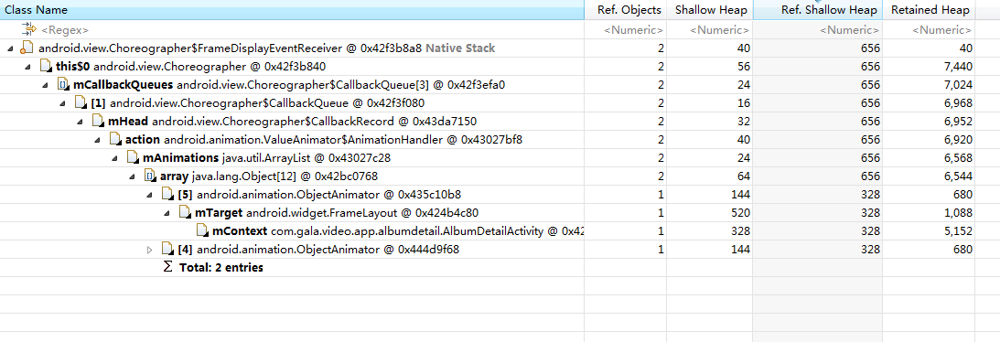

###  Android5.0以下系统，由于ValueAnimator多次start引起的内存泄漏问题

#### 源码

[android.animation.ValueAnimator](https://android.googlesource.com/platform/frameworks/base/+/refs/tags/android-4.4_r1/core/java/android/animation/ValueAnimator.java)

```Java
public class ValueAnimator extends Animator {
    .......
    private static AnimationHandler getOrCreateAnimationHandler() {
        AnimationHandler handler = sAnimationHandler.get();
        if (handler == null) {
            handler = new AnimationHandler();
            sAnimationHandler.set(handler);
        }
        return handler;
    }
    .......
    private void start(boolean playBackwards) {
        if (Looper.myLooper() == null) {
            throw new AndroidRuntimeException("Animators may only be run on Looper threads");
        }
        mPlayingBackwards = playBackwards;
        mCurrentIteration = 0;
        mPlayingState = STOPPED;
        mStarted = true;
        mStartedDelay = false;
        mPaused = false;
        AnimationHandler animationHandler = getOrCreateAnimationHandler();
        animationHandler.mPendingAnimations.add(this);
        if (mStartDelay == 0) {
            // This sets the initial value of the animation, prior to actually starting it running
            setCurrentPlayTime(0);
            mPlayingState = STOPPED;
            mRunning = true;
            notifyStartListeners();
        }
        animationHandler.start();
    }
    
    @Override
    public boolean isStarted() {
        return mStarted;
    }
    ......
    private void endAnimation(AnimationHandler handler) {
        handler.mAnimations.remove(this);
        handler.mPendingAnimations.remove(this);
        handler.mDelayedAnims.remove(this);
        mPlayingState = STOPPED;
        mPaused = false;
        if ((mStarted || mRunning) && mListeners != null) {
            if (!mRunning) {
                // If it's not yet running, then start listeners weren't called. Call them now.
                notifyStartListeners();
             }
            ArrayList<AnimatorListener> tmpListeners =
                    (ArrayList<AnimatorListener>) mListeners.clone();
            int numListeners = tmpListeners.size();
            for (int i = 0; i < numListeners; ++i) {
                tmpListeners.get(i).onAnimationEnd(this);
            }
        }
        mRunning = false;
        mStarted = false;
        mStartListenersCalled = false;
        mPlayingBackwards = false;
        if (Trace.isTagEnabled(Trace.TRACE_TAG_VIEW)) {
            Trace.asyncTraceEnd(Trace.TRACE_TAG_VIEW, getNameForTrace(),
                    System.identityHashCode(this));
        }
    }
    ......
}
```

[android.animation.ValueAnimator$AnimationHandler](https://android.googlesource.com/platform/frameworks/base/+/refs/tags/android-4.4_r1/core/java/android/animation/ValueAnimator.java)

```Java
protected static class AnimationHandler implements Runnable {
    // The per-thread list of all active animations
    /** @hide */
    protected final ArrayList<ValueAnimator> mAnimations = new ArrayList<ValueAnimator>();
    // Used in doAnimationFrame() to avoid concurrent modifications of mAnimations
    private final ArrayList<ValueAnimator> mTmpAnimations = new ArrayList<ValueAnimator>();
    // The per-thread set of animations to be started on the next animation frame
    /** @hide */
    protected final ArrayList<ValueAnimator> mPendingAnimations = new ArrayList<ValueAnimator>();
    /**
     * Internal per-thread collections used to avoid set collisions as animations start and end
     * while being processed.
     * @hide
     */
    protected final ArrayList<ValueAnimator> mDelayedAnims = new ArrayList<ValueAnimator>();
    private final ArrayList<ValueAnimator> mEndingAnims = new ArrayList<ValueAnimator>();
    private final ArrayList<ValueAnimator> mReadyAnims = new ArrayList<ValueAnimator>();
    private final Choreographer mChoreographer;
    private boolean mAnimationScheduled;
    private AnimationHandler() {
        mChoreographer = Choreographer.getInstance();
    }
    ......
    public void start() {
        scheduleAnimation();
    }
    
    // Called by the Choreographer.
    @Override
    public void run() {
        mAnimationScheduled = false;
        doAnimationFrame(mChoreographer.getFrameTime());
    }
    
    private void scheduleAnimation() {
            if (!mAnimationScheduled) {
                mChoreographer.postCallback(Choreographer.CALLBACK_ANIMATION, this, null);
                mAnimationScheduled = true;
            }
        }
    ......
}
```

[android.animation.ObjectAnimator](https://android.googlesource.com/platform/frameworks/base/+/refs/tags/android-4.4_r1/core/java/android/animation/ObjectAnimator.java)

```Java
public final class ObjectAnimator extends ValueAnimator {
    private static final boolean DBG = false;
    // The target object on which the property exists, set in the constructor
    private Object mTarget;
    ......
}
```
*  从源码可以看出，每次start都会先将当前animator添加到AnimationHandler的mPendingAnimations中，然后执行的时候再分别移动到mAnimations或者mDelayedAnims

* 而每次endAnimation只会从AnimationHandler的mAnimations/mPendingAnimations/mDelayedAnims各移除一个animator

* 另外，Android5.0以下系统，mTarget是强引用

* 因此如果重复多次start，而仅调用一次cancel或者end，那么该animator就有可能未被停止，从而出现内存泄漏


#### 实例




#### 总结

###### 前置条件

* 如果ValueAnimator多次调用start，而cancel或者end仅调用一次，这种情况就会出现内存泄漏

* 当然如果动画不是INFINITE，那么也不会出现内存泄漏，但是需要等到动画结束的时候，而这个时候，就是动画未及时停止的问题

###### 分析特征

* 泄漏对象通过ValueAnimator链接到Choreographer


#### 解决

* ValueAnimator在start的时候，通过isStart()判断是否已经start


#### 附注

* Android5.0已修复？
[__Use a weak reference to the ObjectAnimator target__](https://android.googlesource.com/platform/frameworks/base/+/87ac5f60e20fba335497aa9dc03b7c29c4b966a2)

