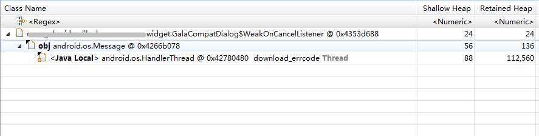

###  Android5.0以下系统，由于Message复用引起的内存泄漏问题

相关链接：

​        [__A small leak will sink a great ship__](https://medium.com/square-corner-blog/a-small-leak-will-sink-a-great-ship-efbae00f9a0f)

#### 源码

[android.os.Looper](https://android.googlesource.com/platform/frameworks/base/+/refs/tags/android-4.4_r1/core/java/android/os/Looper.java)

```java
    /**
     * Run the message queue in this thread. Be sure to call
     * {@link #quit()} to end the loop.
     */
    public static void loop() {
        ......
        for (;;) {
            Message msg = queue.next(); // might block
            if (msg == null) {
                // No message indicates that the message queue is quitting.
                return;
            }
            ......
            msg.target.dispatchMessage(msg);
            ......
            msg.recycle();
        }
    }
```

* 在5.0以下系统，如果 __queue.next()__ 处于阻塞挂起状态，则 __Message msg__ 这个__局部变量__ 依然会存在于__方法栈__ 中（虚拟机相关），而此时该 msg 已经执行 msg.recycle() 方法了，因此该 msg 可能会被 __复用__，这样在某些场景下，就会导致该 msg（复用之后） 所持有的引用无法被及时释放；

* 当然，如果这个线程一直在运行而不阻塞挂起，那么这个问题也就不复存在了；然而，对于 __HandlerThread__ 来说，总会有挂起的时候- 。-

[android.app.Dialog](https://android.googlesource.com/platform/frameworks/base/+/refs/tags/android-4.4_r1/core/java/android/app/Dialog.java)

```java
public class Dialog implements DialogInterface, Window.Callback,
        KeyEvent.Callback, OnCreateContextMenuListener {
        
    ......
    private Message mCancelMessage;
    private Message mDismissMessage;
    private Message mShowMessage;

    ......
    /**
     * Sets a listener to be invoked when the dialog is shown.
     * @param listener The {@link DialogInterface.OnShowListener} to use.
     */
    public void setOnShowListener(OnShowListener listener) {
        if (listener != null) {
            mShowMessage = mListenersHandler.obtainMessage(SHOW, listener);
        } else {
            mShowMessage = null;
        }
    }
    
    ......
    private void sendShowMessage() {
        if (mShowMessage != null) {
            // Obtain a new message so this dialog can be re-used
            Message.obtain(mShowMessage).sendToTarget();
        }
    }
    ......
}
```

* 实际上，如果这个 msg 不断的被回收并复用，那么这个内存泄漏也是很短暂的一瞬间，可以忽略；但是如果这个msg不会被回收复用呢？比如 __Dialog__ 

* 从 Dialog 的源代码可以发现，__mCancelMessage/mDismissMessage/mShowMessage__ 都是通过 __Message.obtain()__ 方法创建的，也就是说有很大的可能是复用已回收的 Message，但是这几个 Message 都__不会再次被回收复用__

* 如果这几个 Message 恰好又是上文中提到的 Message ，那么这个 Message 就无法被及时回收，另外因为这几个 Message 都持有匿名内部类，也就是间接持有 Dialog 引用，这样就会引起 Dialog 内存泄漏。


#### 实例



上图为 Dialog 泄漏的实例，GalaCompatDialog 是兼容处理类，因此图上这个 Dialog 没有出现内存泄漏；但是从这个图上，可以清楚的看到整个泄漏的过程；可以想象如果这个 Message 持有的不是 WeakOnCancelListener，那么这个 Dialog 就无法被及时回收。


#### 总结

###### 前置条件

* Android 5.0 以下系统(Dalvik虚拟机)

* HandlerThread 阻塞挂起，最后一个 Message 已经被回收待复用

* 该 Message 被复用，且未再次被回收

###### 分析特征

* 泄漏对象因为 Message 而被链接到一个(无关的) HandlerThread

* 一般为方法栈引起的泄漏(Java Local)


#### 解决

* Android 5.0 及以上系统(ART虚拟机)，无需处理

* 使用 Dialog 时，尽量确保 On[Cancel|Dismiss|Show]Listener 不以强引用的方式持有外部对象 或 退出时调用 setOn[Cancel|Dismiss|Show]Listener(null)

* 涉及 Message 回收复用的逻辑，尽量确保 Message 会再次被回收


#### 附注

*  Android 5.0 及以上系统(ART虚拟机)，该问题已经修复


