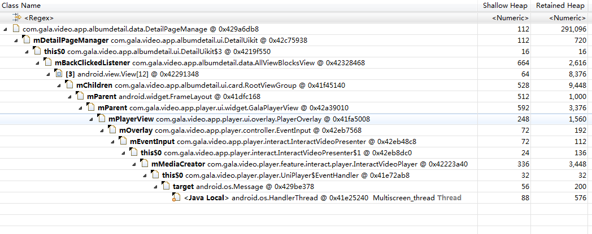

###  Android5.0以下系统，由于Message复用引起的内存泄漏问题

相关链接：

​        [__A small leak will sink a great ship__](https://medium.com/square-corner-blog/a-small-leak-will-sink-a-great-ship-efbae00f9a0f)

#### 源码

[android.os.Looper](https://android.googlesource.com/platform/frameworks/base/+/refs/tags/android-4.4_r1/core/java/android/os/Looper.java)
```java
    /**
     * Run the message queue in this thread. Be sure to call
     * {@link #quit()} to end the loop.
     */
    public static void loop() {
        ......
        for (;;) {
            Message msg = queue.next(); // might block
            if (msg == null) {
                // No message indicates that the message queue is quitting.
                return;
            }
            ......
            msg.target.dispatchMessage(msg);
            ......
            msg.recycle();
        }
    }
```

* 在5.0以下系统，如果queue.next()处于阻塞挂起状态，则Message msg这个_局部变量_依然会存在于_方法栈_中，而此时该msg已经msg.recycle()，因此该msg可能会被_复用_，这样就会导致该msg所持有的引用无法被及时释放；

* 当然，如果这个线程一直在运行而不阻塞挂起，那么这个问题也就不复存在了；不幸的是，HandlerThread总会有挂起的时候- 。-

[android.app.Dialog](https://android.googlesource.com/platform/frameworks/base/+/refs/tags/android-4.4_r1/core/java/android/app/Dialog.java)
```java
public class Dialog implements DialogInterface, Window.Callback,
        KeyEvent.Callback, OnCreateContextMenuListener {
        
    ......
    private Message mCancelMessage;
    private Message mDismissMessage;
    private Message mShowMessage;

    ......
    /**
     * Sets a listener to be invoked when the dialog is shown.
     * @param listener The {@link DialogInterface.OnShowListener} to use.
     */
    public void setOnShowListener(OnShowListener listener) {
        if (listener != null) {
            mShowMessage = mListenersHandler.obtainMessage(SHOW, listener);
        } else {
            mShowMessage = null;
        }
    }
    
    ......
    private void sendShowMessage() {
        if (mShowMessage != null) {
            // Obtain a new message so this dialog can be re-used
            Message.obtain(mShowMessage).sendToTarget();
        }
    }
    ......
}
```

* 实际上，如果这个msg不断的被回收并复用，那么这个内存泄漏也是很短暂的一瞬间，可以忽略；但是如果这个msg不会被回收复用呢？比如_Dialog_ .

* 从Dialog的源代码可以发现，mCancelMessage/mDismissMessage/mShowMessage都是从通过obtainMessage方法创建的，也就是说有很大的可能是复用已回收的Message，但是这几个Message都不会再次被回收复用；

* 如果这几个Message恰好又是上文中提到的Message，那么这个Message就无法被及时回收，另外因为这几个Message都持有匿名内部类，也就是间接持有Dialog引用，这样就会引起Dialog内存泄漏。


#### 实例


上图为Dialog泄漏的实例，GalaCompatDialog是兼容处理类，因此图上这个Dialog不存在泄漏；但是从这个图上，可以清楚的看到整个泄漏的过程；可以想象如果这个Message持有的不是WeakOnCancelListener，那么这个Dialog就无法被及时回收。




上图为该问题“实战”，最后确认的问题为：在使用自定义Handler时，复用已回收的Message，但是该Message并未再次回收，因此引起的内存泄漏问题；


#### 总结

###### 前置条件

* Android5.0以下系统(Dalvik虚拟机)

* HandlerThread阻塞挂起，最后一个Message已经被回收待复用

* 该Message被复用，且未再次被回收

###### 分析特征

* 泄漏对象因为Message而被链接到一个(无关的)HandlerThread

* 一般为调用栈引起的泄漏(Java Local)


#### 解决

* Android5.0及以上系统(ART虚拟机)，无需处理

* 使用Dialog时，尽量确保On[Cancel|Dismiss|Show]Listener不以强引用的方式持有外部对象；可以参考或使用已有的兼容处理类GalaCompatDialog/GalaCompatAlertDialog/GalaCompatDialogFragment

* 涉及Message回收复用的逻辑，尽量确保Message会再次被回收复用

* 规范或者统一HandlerThread的使用(待议)


#### 附注

*  Android5.0及以上系统(ART虚拟机)，该问题已经修复


