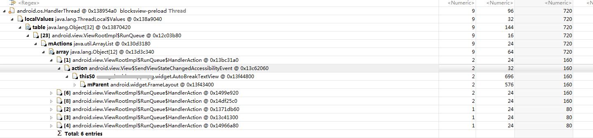
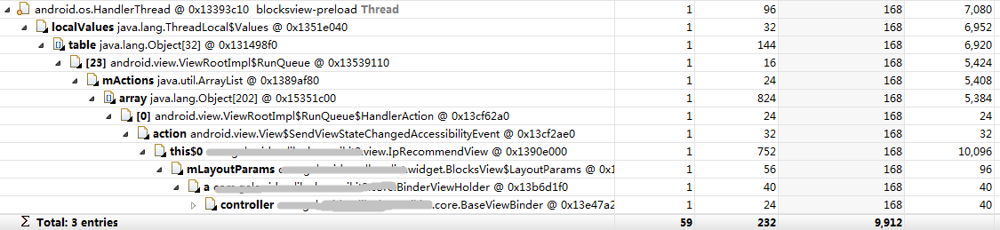

###  Android7.0以下系统，由View的post()方法引起的内存泄漏问题


#### 源码/RTFSC

[android.view.View](https://android.googlesource.com/platform/frameworks/base/+/refs/tags/android-5.0.0_r2/core/java/android/view/View.java)
```java
public boolean post(Runnable action) {
        final AttachInfo attachInfo = mAttachInfo;
        if (attachInfo != null) {
            return attachInfo.mHandler.post(action);
        }
        // Assume that post will succeed later
        ViewRootImpl.getRunQueue().post(action);
        return true;
}
```
* 如果在View还未attach的状态下，调用post()方法，从源码可以看出，会将该Runnable post到ViewRootImpl的RunQueue中

[android.view.ViewRootImpl](https://android.googlesource.com/platform/frameworks/base/+/refs/tags/android-5.0.0_r2/core/java/android/view/ViewRootImpl.java)
```java
static final ThreadLocal<RunQueue> sRunQueues = new ThreadLocal<RunQueue>();

static RunQueue getRunQueue() {
        RunQueue rq = sRunQueues.get();
        if (rq != null) {
            return rq;
        }
        rq = new RunQueue();
        sRunQueues.set(rq);
        return rq;
}
```

* 而该RunQueue是以静态ThreadLocal的方式存储的

```java
private void performTraversals() {
        ......
        // Execute enqueued actions on every traversal in case a detached view enqueued    an action 
        getRunQueue().executeActions(mAttachInfo.mHandler);
        ......
}
```
* 该Runnable最后会在__performTraversals()__时执行，我们知道该方法是在__主线程__中执行的；那么，这就存在一个问题，就是__如果我们是在非主线程post的话，那么该Runnable将不会被执行且一直缓存在ThreadLocal中，直到线程被销毁__

[android.view.ViewRootImpl$RunQueue](https://android.googlesource.com/platform/frameworks/base/+/refs/tags/android-5.0.0_r2/core/java/android/view/ViewRootImpl.java)
```java
    /**
     * The run queue is used to enqueue pending work from Views when no Handler is
     * attached.  The work is executed during the next call to performTraversals on
     * the thread.
     * @hide
     */
    static final class RunQueue {
        private final ArrayList<HandlerAction> mActions = new ArrayList<HandlerAction>();
        void post(Runnable action) {
            postDelayed(action, 0);
        }
        void postDelayed(Runnable action, long delayMillis) {
            HandlerAction handlerAction = new HandlerAction();
            handlerAction.action = action;
            handlerAction.delay = delayMillis;
            synchronized (mActions) {
                mActions.add(handlerAction);
            }
        }
        void removeCallbacks(Runnable action) {
            final HandlerAction handlerAction = new HandlerAction();
            handlerAction.action = action;
            synchronized (mActions) {
                final ArrayList<HandlerAction> actions = mActions;
                while (actions.remove(handlerAction)) {
                    // Keep going
                }
            }
        }
        void executeActions(Handler handler) {
            synchronized (mActions) {
                final ArrayList<HandlerAction> actions = mActions;
                final int count = actions.size();
                for (int i = 0; i < count; i++) {
                    final HandlerAction handlerAction = actions.get(i);
                    handler.postDelayed(handlerAction.action, handlerAction.delay);
                }
                actions.clear();
            }
        }
        private static class HandlerAction {
            Runnable action;
            long delay;
            @Override
            public boolean equals(Object o) {
                if (this == o) return true;
                if (o == null || getClass() != o.getClass()) return false;
                HandlerAction that = (HandlerAction) o;
                return !(action != null ? !action.equals(that.action) : that.action != null);
            }
            @Override
            public int hashCode() {
                int result = action != null ? action.hashCode() : 0;
                result = 31 * result + (int) (delay ^ (delay >>> 32));
                return result;
            }
        }
    }
```


#### 实例




#### 总结

###### 前置条件

* Android7.0以下系统
  
* 非主线程

* View未attach

###### 分析特征

* 泄漏对象通过HandlerAction被链接到一个(无关的)HandlerThread


#### 解决

针对该泄漏出现的条件，可以有以下几种方案：

* Android7.0及以上系统无需处理
  
* Android7.0以下系统，避免在__非主线程__而且__View未attach__的情况下post

* 避免Runnable持有外部引用(主要是避免以匿名内部类的方式使用Runnable)
  


#### 附注

* 该问题在Android7.0及其以上已经修复了，详情见链接[Keep local run queue in View to avoid posting to wrong thread](https://android.googlesource.com/platform/frameworks/base/+/bea0c7daa6611d8b96e1271f8854f500a87342fc)

* 另外，由于sendAccessibilityEvent也有可能会在非主线程调用post方法，因此应该尽量通过覆盖VIew类post方法的方式兼容处理该问题

[android.view.View$SendViewStateChangedAccessibilityEvent](https://android.googlesource.com/platform/frameworks/base/+/refs/tags/android-5.0.0_r2/core/java/android/view/View.java)
```java
private class SendViewStateChangedAccessibilityEvent implements Runnable {
        private int mChangeTypes = 0;
        private boolean mPosted;
        private boolean mPostedWithDelay;
        private long mLastEventTimeMillis;
        @Override
        public void run() {
            mPosted = false;
            mPostedWithDelay = false;
            mLastEventTimeMillis = SystemClock.uptimeMillis();
            if (AccessibilityManager.getInstance(mContext).isEnabled()) {
                final AccessibilityEvent event = AccessibilityEvent.obtain();
                event.setEventType(AccessibilityEvent.TYPE_WINDOW_CONTENT_CHANGED);
                event.setContentChangeTypes(mChangeTypes);
                sendAccessibilityEventUnchecked(event);
            }
            mChangeTypes = 0;
        }
        public void runOrPost(int changeType) {
            mChangeTypes |= changeType;
            // If this is a live region or the child of a live region, collect
            // all events from this frame and send them on the next frame.
            if (inLiveRegion()) {
                // If we're already posted with a delay, remove that.
                if (mPostedWithDelay) {
                    removeCallbacks(this);
                    mPostedWithDelay = false;
                }
                // Only post if we're not already posted.
                if (!mPosted) {
                    post(this);
                    mPosted = true;
                }
                return;
            }
            if (mPosted) {
                return;
            }
            final long timeSinceLastMillis = SystemClock.uptimeMillis() - mLastEventTimeMillis;
            final long minEventIntevalMillis =
                    ViewConfiguration.getSendRecurringAccessibilityEventsInterval();
            if (timeSinceLastMillis >= minEventIntevalMillis) {
                removeCallbacks(this);
                run();
            } else {
                postDelayed(this, minEventIntevalMillis - timeSinceLastMillis);
                mPostedWithDelay = true;
            }
        }
    }
```


