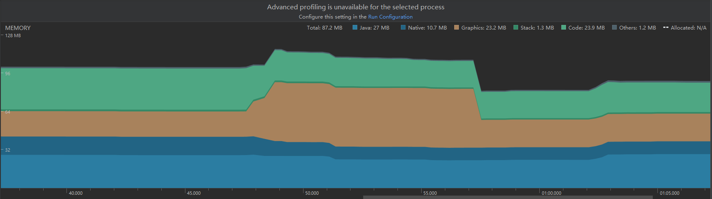
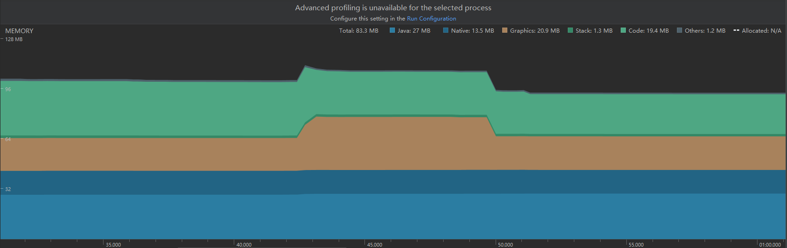

###                                                Android硬件加速引起的显存异常增高问题


#### 问题



如图所示，这是打开模式切换Dialog时，内存变化的截图，从这个图中可以看到，进入这个Dialog显存的变化分为两个阶段 22MB ~ 34MB 以及 34MB ~ 49MB，第一个阶段是Dialog显示的显存，而第二个阶段则是动画引起的显存变化。

为什么动画消耗的显存会比Dialog显示时的显存要大，而且这部分显存在动画结束之后仍然没有回收？这个似乎跟我们平常的认知不太一样。


####  原因

经过测试验证，发现这部分显存增长与__硬件加速__有关，并且也与动画中包含__透明度变化__有关，最后在Google的源码中找到了答案：

[Promote RenderProperties with an alpha to have a RenderLayer](https://android.googlesource.com/platform/frameworks/base/+/856f0cc3e382206e67c1a62fe878627d7dd9ada5)

```cpp
+    LayerType effectiveLayerType() const {
+        LayerType type = mLayerProperties.mType;
+        if (type == LayerType::None
+                && !MathUtils::isZero(mPrimitiveFields.mAlpha)
+                && mPrimitiveFields.mAlpha < 1
+                && mPrimitiveFields.mHasOverlappingRendering) {
+            return LayerType::RenderLayer;
+        }
+        return type;
+    }
```

Google在这个commit添加了一个关键更改：即使View设置的 _mLayerType_ 是 _LAYER_TYPE_NONE_，如果该View是半透明状态的 (0 < mAlpha < 1)，且其 _hasOverlappingRendering()_ 方法返回值是 _true_ (默认为true)，那么也会为该View创建一个 __Layer__。

回到上面这个问题，当Dialog显示的时候，此时只有一个__Layer__，因此显存增加了 _12MB_ 左右；而当动画启动之后，由于该动画包含有透明度，因此系统为这个View ( 1920x960 ) 也创建了一个__Layer (对应有一个FBO即Frame Buffer Object)__，导致显存再增大 _15MB_，当然这 _15MB_ 应该还包括动画附带的其他显存消耗。


#### 解决

Google官方后来也发现了类似的问题，因此在原来基础上增加了一些限制:

[Revert to save-layer based alpha if layer would be too large](https://android.googlesource.com/platform/frameworks/base/+/4e9d9b2a590105035c29f12ecf0689333e6b55e7)

```java
     bool promotedToLayer() const {
+        const int maxTextureSize = Caches::getInstance().maxTextureSize;
         return mLayerProperties.mType == LayerType::None
                 && !MathUtils::isZero(mPrimitiveFields.mAlpha)
                 && mPrimitiveFields.mAlpha < 1
-                && mPrimitiveFields.mHasOverlappingRendering;
+                && mPrimitiveFields.mHasOverlappingRendering
+                && mPrimitiveFields.mWidth <= maxTextureSize
+                && mPrimitiveFields.mHeight <= maxTextureSize;
     }
```
实际上，就是对layer的大小做了一个限制。这个值应该是大于屏幕尺寸的，因此这个限制对我们并无用处。


当然，从源代码可以看出，我们似乎可以通过覆写View类的 _hasOverlappingRendering()_ 方法来跳过这个逻辑，不妨一试:



这个截图显示的就是覆写 _hasOverlappingRendering()_ 方法之后测试的内存变化趋势，从图中可以看出，从Dialog显示到动画结束的整个过程，显存变化为 22MB ~ 35MB，少了 _14MB_ 左右。


但是 _hasOverlappingRendering()_ 方法并不是可以随便覆写的，我们来看一下  _hasOverlappingRendering()_ 方法的注释：

[View.java](https://android.googlesource.com/platform/frameworks/base/+/refs/tags/android-8.0.0_r45/core/java/android/view/View.java)

```java
    /**
    * This function, intended to be overridden by specific View types, is an optimization when
     * alpha is set on a view. If rendering overlaps in a view with alpha < 1, that view is drawn to
     * an offscreen buffer and then composited into place, which can be expensive. If the view has
     * no overlapping rendering, the view can draw each primitive with the appropriate alpha value
     * directly. 
     */
    @ViewDebug.ExportedProperty(category = "drawing")
    public boolean hasOverlappingRendering() {
        return true;
    }
```

简而言之，就是 _hasOverlappingRendering(...)_ 这个函数与绘制过程有关：

* 如果函数返回是 _true_ ，那么就会先绘制到 __offscreen buffer__，然后再计算透明度并绘制到canvas；对于开启硬件加速的时候，这个 _offscreen buffer_ 也许就是layer。

* 而如果函数返回的是false，那么就会分别计算透明度并绘制到canvas中。

以颜色叠加为例，先叠加再计算透明度 与 分别计算透明度再叠加的效果可能是完全不一样。因此我们只能在确认安全的情况下才可以覆写这个方法。


目前来看没有完美的办法可以解决这个问题，能做的只有：__当动画涉及透明度的时候，应尽量减小其尺寸(比如分拆)__，当然也可以适当考虑覆写 _hasOverlappingRendering()_ 方法。


#### 附注

严格意义上来说这不是个内存泄漏问题，因为虽然这部分显存没有被回收，但是这部分显存是保存在LRU缓存中，可以循环复用的。这部分显存被回收时机包括：

* 页面退出或者不可见的时候
* LRU缓存到达最大值的时候
* 内存资源紧张的时候


#### 附：显存回收(非释放)过程

[RenderNode.cpp](https://android.googlesource.com/platform/frameworks/base/+/refs/tags/android-6.0.1_r81/libs/hwui/RenderNode.cpp)
```cpp
void RenderNode::deleteDisplayListData() {
    if (mDisplayListData) {
        for (size_t i = 0; i < mDisplayListData->children().size(); i++) {
            mDisplayListData->children()[i]->mRenderNode->decParentRefCount();
        }
        if (mDisplayListData->functors.size()) {
            Caches::getInstance().unregisterFunctors(mDisplayListData->functors.size());
        }
    }
    delete mDisplayListData;
    mDisplayListData = nullptr;
}

void RenderNode::decParentRefCount() {
    LOG_ALWAYS_FATAL_IF(!mParentCount, "already 0!");
    mParentCount--;
    if (!mParentCount) {
        // If a child of ours is being attached to our parent then this will incorrectly
        // destroy its hardware resources. However, this situation is highly unlikely
        // and the failure is "just" that the layer is re-created, so this should
        // be safe enough
        destroyHardwareResources();
    }
}

void RenderNode::destroyHardwareResources() {
    if (mLayer) {
        LayerRenderer::destroyLayer(mLayer);
        mLayer = nullptr;
    }
    if (mDisplayListData) {
        for (size_t i = 0; i < mDisplayListData->children().size(); i++) {
            mDisplayListData->children()[i]->mRenderNode->destroyHardwareResources();
        }
        if (mNeedsDisplayListDataSync) {
            // Next prepare tree we are going to push a new display list, so we can
            // drop our current one now
            deleteDisplayListData();
        }
    }
}
```

父节点释放子节点引用的时候，即会清除子节点及其子节点的HardwareResources；当然还有另一种情况就是 LayerType 或 尺寸 发生变化并重绘的时候。

[LayerRenderer.cpp](https://android.googlesource.com/platform/frameworks/base/+/refs/tags/android-6.0.1_r81/libs/hwui/LayerRenderer.cpp)
```cpp
void LayerRenderer::destroyLayer(Layer* layer) {
    if (layer) {
        ATRACE_FORMAT("Destroy %ux%u HW Layer", layer->getWidth(), layer->getHeight());
        LAYER_RENDERER_LOGD("Recycling layer, %dx%d fbo = %d",
                layer->getWidth(), layer->getHeight(), layer->getFbo());
        if (!Caches::getInstance().layerCache.put(layer)) {
            LAYER_RENDERER_LOGD("  Destroyed!");
            layer->decStrong(nullptr);
        } else {
            LAYER_RENDERER_LOGD("  Cached!");
#if DEBUG_LAYER_RENDERER
            Caches::getInstance().layerCache.dump();
#endif
            layer->removeFbo();
            layer->region.clear();
        }
    }
}
```
系统先尝试将缓存 layer，如果失败了则释放layer资源。 

[LayerCache.cpp](https://android.googlesource.com/platform/frameworks/base/+/refs/tags/android-6.0.1_r81/libs/hwui/LayerCache.cpp)
```cpp
bool LayerCache::put(Layer* layer) {
    if (!layer->isCacheable()) return false;
    const uint32_t size = layer->getWidth() * layer->getHeight() * 4;
    // Don't even try to cache a layer that's bigger than the cache
    if (size < mMaxSize) {
        // TODO: Use an LRU
        while (mSize + size > mMaxSize) {
            size_t position = 0;
#if LAYER_REMOVE_BIGGEST_FIRST
            position = mCache.size() - 1;
#endif
            Layer* victim = mCache.itemAt(position).mLayer;
            deleteLayer(victim);
            mCache.removeAt(position);
            LAYER_LOGD("  Deleting layer %.2fx%.2f", victim->layer.getWidth(),
                    victim->layer.getHeight());
        }
        layer->cancelDefer();
        LayerEntry entry(layer);
        mCache.add(entry);
        mSize += size;
        layer->state = Layer::kState_InCache;
        return true;
    }
    layer->state = Layer::kState_FailedToCache;
    return false;
}
```

首先会过滤掉大小超限制的layer，其次再更新LRU缓存，然后缓存该layer。


#### 附：显存复用过程

[RenderNode.cpp)](https://android.googlesource.com/platform/frameworks/base/+/refs/tags/android-6.0.1_r81/libs/hwui/RenderNode.cpp)

```cpp
void RenderNode::pushLayerUpdate(TreeInfo& info) {
    LayerType layerType = properties().effectiveLayerType();
    // If we are not a layer OR we cannot be rendered (eg, view was detached)
    // we need to destroy any Layers we may have had previously
    if (CC_LIKELY(layerType != LayerType::RenderLayer) || CC_UNLIKELY(!isRenderable())) {
        if (CC_UNLIKELY(mLayer)) {
            LayerRenderer::destroyLayer(mLayer);
            mLayer = nullptr;
        }
        return;
    }
    bool transformUpdateNeeded = false;
    if (!mLayer) {
        mLayer = LayerRenderer::createRenderLayer(info.renderState, getWidth(), getHeight());
        applyLayerPropertiesToLayer(info);
        damageSelf(info);
        transformUpdateNeeded = true;
    } else if (mLayer->layer.getWidth() != getWidth() || mLayer->layer.getHeight() != getHeight()) {
        if (!LayerRenderer::resizeLayer(mLayer, getWidth(), getHeight())) {
            LayerRenderer::destroyLayer(mLayer);
            mLayer = nullptr;
        }
        damageSelf(info);
        transformUpdateNeeded = true;
    }
    ......
}
```

页面刷新重绘的时候才会真正创建layer，在这里我们也看到如果 LayerType 不支持创建 layer，则会回收原来的 layer，另外对于尺寸不合适的 layer，会尝试重新分配其大小，如果失败了才回收该layer。

[LayerRenderer.cpp](https://android.googlesource.com/platform/frameworks/base/+/refs/tags/android-6.0.1_r81/libs/hwui/LayerRenderer.cpp)
```cpp
Layer* LayerRenderer::createRenderLayer(RenderState& renderState, uint32_t width, uint32_t height) {
    ATRACE_FORMAT("Allocate %ux%u HW Layer", width, height);
    LAYER_RENDERER_LOGD("Requesting new render layer %dx%d", width, height);
    Caches& caches = Caches::getInstance();
    GLuint fbo = caches.fboCache.get();
    if (!fbo) {
        ALOGW("Could not obtain an FBO");
        return nullptr;
    }
    caches.textureState().activateTexture(0);
    Layer* layer = caches.layerCache.get(renderState, width, height);
    if (!layer) {
        ALOGW("Could not obtain a layer");
        return nullptr;
    }
    ......
    return layer;
}
```

这里我们看到，系统会优先从LRU缓存中查找有没有合适的layer缓存，如果没有才去创建一个新的layer。

[LayerCache.cpp](https://android.googlesource.com/platform/frameworks/base/+/refs/tags/android-6.0.1_r81/libs/hwui/LayerCache.cpp)
```cpp
Layer* LayerCache::get(RenderState& renderState, const uint32_t width, const uint32_t height) {
    Layer* layer = nullptr;
    LayerEntry entry(width, height);
    ssize_t index = mCache.indexOf(entry);
    if (index >= 0) {
        entry = mCache.itemAt(index);
        mCache.removeAt(index);
        layer = entry.mLayer;
        layer->state = Layer::kState_RemovedFromCache;
        mSize -= layer->getWidth() * layer->getHeight() * 4;
        LAYER_LOGD("Reusing layer %dx%d", layer->getWidth(), layer->getHeight());
    } else {
        LAYER_LOGD("Creating new layer %dx%d", entry.mWidth, entry.mHeight);
        layer = new Layer(Layer::kType_DisplayList, renderState, entry.mWidth, entry.mHeight);
        layer->setBlend(true);
        layer->generateTexture();
        layer->bindTexture();
        layer->setFilter(GL_NEAREST);
        layer->setWrap(GL_CLAMP_TO_EDGE, false);
        glPixelStorei(GL_UNPACK_ALIGNMENT, 4);
#if DEBUG_LAYERS
        dump();
#endif
    }
    return layer;
}
```


#### 附：显存清除过程

[ViewRootImpl.java](https://android.googlesource.com/platform/frameworks/base/+/refs/tags/android-6.0.1_r81/core/java/android/view/ViewRootImpl.java)
```java
    void destroyHardwareResources() {
        if (mAttachInfo.mHardwareRenderer != null) {
            mAttachInfo.mHardwareRenderer.destroyHardwareResources(mView);
            mAttachInfo.mHardwareRenderer.destroy();
        }
    }
```
页面退出或者不可见的时候，会调用ViewRootImpl的destroyHardwareResources方法，清除HardwareResources，包括显存。

[ThreadedRenderer.java](https://android.googlesource.com/platform/frameworks/base/+/refs/tags/android-6.0.1_r81/core/java/android/view/ThreadedRenderer.java)
```java
    @Override
    void destroyHardwareResources(View view) {
        destroyResources(view);
        nDestroyHardwareResources(mNativeProxy);
    }
```

[android_view_ThreadedRenderer.cpp](https://android.googlesource.com/platform/frameworks/base/+/refs/tags/android-6.0.1_r81/core/jni/android_view_ThreadedRenderer.cpp)

```cpp
static void android_view_ThreadedRenderer_destroyHardwareResources(JNIEnv* env, jobject clazz,
        jlong proxyPtr) {
    RenderProxy* proxy = reinterpret_cast<RenderProxy*>(proxyPtr);
    proxy->destroyHardwareResources();
}
```

[RenderProxy.cpp](https://android.googlesource.com/platform/frameworks/base/+/refs/tags/android-6.0.1_r81/libs/hwui/renderthread/RenderProxy.cpp)
```cpp
CREATE_BRIDGE1(destroyHardwareResources, CanvasContext* context) {
    args->context->destroyHardwareResources();
    return nullptr;
}
void RenderProxy::destroyHardwareResources() {
    SETUP_TASK(destroyHardwareResources);
    args->context = mContext;
    post(task);
}
```
[CanvasContext.cpp](https://android.googlesource.com/platform/frameworks/base/+/refs/tags/android-6.0.1_r81/libs/hwui/renderthread/CanvasContext.cpp)

```cpp
void CanvasContext::destroyHardwareResources() {
    stopDrawing();
    if (mEglManager.hasEglContext()) {
        freePrefetechedLayers();
        mRootRenderNode->destroyHardwareResources();
        Caches& caches = Caches::getInstance();
        // Make sure to release all the textures we were owning as there won't
        // be another draw
        caches.textureCache.resetMarkInUse(this);
        caches.flush(Caches::kFlushMode_Layers);
    }
}

void CanvasContext::trimMemory(RenderThread& thread, int level) {
    // No context means nothing to free
    if (!thread.eglManager().hasEglContext()) return;
    ATRACE_CALL();
    if (level >= TRIM_MEMORY_COMPLETE) {
        Caches::getInstance().flush(Caches::kFlushMode_Full);
        thread.eglManager().destroy();
    } else if (level >= TRIM_MEMORY_UI_HIDDEN) {
        Caches::getInstance().flush(Caches::kFlushMode_Moderate);
    }
}
```


[Caches.cpp](https://android.googlesource.com/platform/frameworks/base/+/refs/tags/android-6.0.1_r81/libs/hwui/Caches.cpp)

```cpp
void Caches::flush(FlushMode mode) {
    FLUSH_LOGD("Flushing caches (mode %d)", mode);
    switch (mode) {
        case kFlushMode_Full:
            textureCache.clear();
            patchCache.clear();
            dropShadowCache.clear();
            gradientCache.clear();
            fontRenderer->clear();
            fboCache.clear();
            dither.clear();
            // fall through
        case kFlushMode_Moderate:
            fontRenderer->flush();
            textureCache.flush();
            pathCache.clear();
            tessellationCache.clear();
            // fall through
        case kFlushMode_Layers:
            layerCache.clear();
            renderBufferCache.clear();
            break;
    }
    clearGarbage();
    glFinish();
    // Errors during cleanup should be considered non-fatal, dump them and
    // and move on. TODO: All errors or just errors like bad surface?
    GLUtils::dumpGLErrors();
}
```

