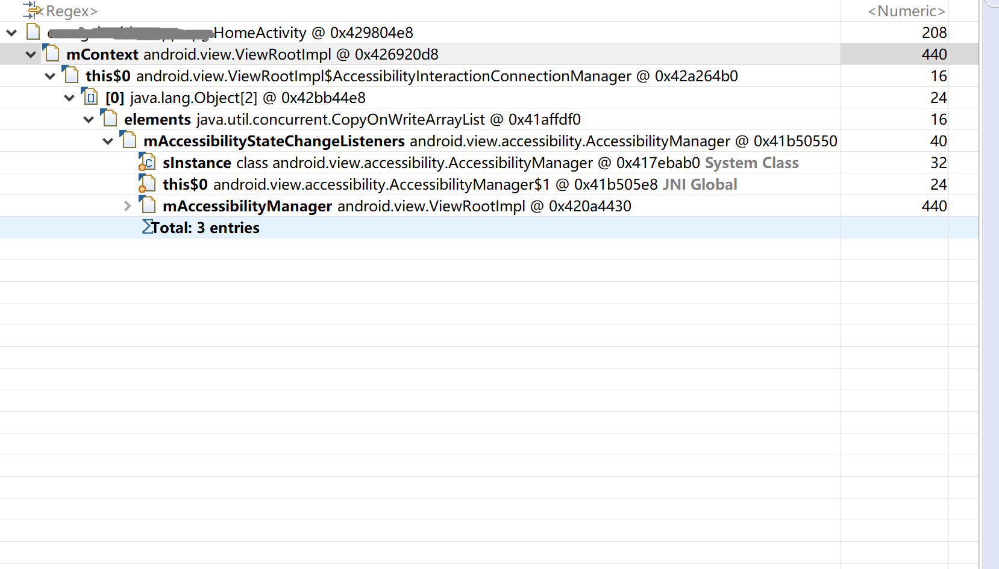

### BadWindowTokenException 引起的内存泄漏问题分析


#### 实例



从 dump 的 hprof 文件可以看出，该 Activity 被链接到 ViewRootImpl 中，而 ViewRootImpl 又被内部类链接到 AccessibilityManager 单例中，从而导致该 Activity 无法被释放。


#### 原因

[WindowManagerGlobal.java](https://android.googlesource.com/platform/frameworks/base/+/master/core/java/android/view/WindowManagerGlobal.java)

```java
public void addView(View view, ViewGroup.LayoutParams params,
            Display display, Window parentWindow, int userId) {
        ......
        final WindowManager.LayoutParams wparams = (WindowManager.LayoutParams) params;
        if (parentWindow != null) {
            parentWindow.adjustLayoutParamsForSubWindow(wparams);
        } else {
            // If there's no parent, then hardware acceleration for this view is
            // set from the application's hardware acceleration setting.
            final Context context = view.getContext();
            if (context != null
                    && (context.getApplicationInfo().flags
                            & ApplicationInfo.FLAG_HARDWARE_ACCELERATED) != 0) {
                wparams.flags |= WindowManager.LayoutParams.FLAG_HARDWARE_ACCELERATED;
            }
        }
        ViewRootImpl root;
        View panelParentView = null;
        synchronized (mLock) {
            ......
            int index = findViewLocked(view, false);
            if (index >= 0) {
                ......
            }
            ......
            // 创建 ViewRootImpl
            root = new ViewRootImpl(view.getContext(), display);
            view.setLayoutParams(wparams);
            mViews.add(view);
            mRoots.add(root);
            mParams.add(wparams);
            // do this last because it fires off messages to start doing things
            try {
                // 调用 setView
                root.setView(view, wparams, panelParentView, userId);
            } catch (RuntimeException e) {
                // BadTokenException or InvalidDisplayException, clean up.
                if (index >= 0) {
                    // 调用 removeViewLocked
                    removeViewLocked(index, true);
                }
                throw e;
            }
        }
    }
```

[ViewRootImpl.java](https://android.googlesource.com/platform/frameworks/base/+/master/core/java/android/view/ViewRootImpl.java)

```java
    public ViewRootImpl(Context context, Display display, IWindowSession session,
            boolean useSfChoreographer) {
        // init mContext
        mContext = context;
        ......
        mAccessibilityManager = AccessibilityManager.getInstance(context);
        // addAccessibilityStateChangeListener
        mAccessibilityManager.addAccessibilityStateChangeListener(
                mAccessibilityInteractionConnectionManager, mHandler);
        ......
    }
```

```java
public void setView(View view, WindowManager.LayoutParams attrs, View panelParentView,
            int userId) {
        synchronized (this) {
            if (mView == null) {
                mView = view;
                ......
                mAdded = true;
                ......
                try {
                    ......
                    res = mWindowSession.addToDisplayAsUser(mWindow, mSeq, mWindowAttributes,
                            getHostVisibility(), mDisplay.getDisplayId(), userId, mTmpFrame,
                            mAttachInfo.mContentInsets, mAttachInfo.mStableInsets,
                            mAttachInfo.mDisplayCutout, inputChannel,
                            mTempInsets, mTempControls);
                    setFrame(mTmpFrame);
                } catch (RemoteException e) {
                    // IPC抛出异常，这里也将 mAdded 置为 false
                    mAdded = false;
                    mView = null;
                    mAttachInfo.mRootView = null;
                    inputChannel = null;
                    mFallbackEventHandler.setView(null);
                    unscheduleTraversals();
                    setAccessibilityFocus(null, null);
                    throw new RuntimeException("Adding window failed", e);
                } finally {
                    if (restore) {
                        attrs.restore();
                    }
                }
                .......
                if (res < WindowManagerGlobal.ADD_OKAY) {
                    mAttachInfo.mRootView = null;
                    // 当 Window 添加失败时，这里将 mAdded 置为 false，但是后续并没有其他的处理逻辑
                    mAdded = false;
                    mFallbackEventHandler.setView(null);
                    unscheduleTraversals();
                    setAccessibilityFocus(null, null);
                    switch (res) {
                        case WindowManagerGlobal.ADD_BAD_APP_TOKEN:
                        case WindowManagerGlobal.ADD_BAD_SUBWINDOW_TOKEN:
                            throw new WindowManager.BadTokenException(
                                    "Unable to add window -- token " + attrs.token
                                    + " is not valid; is your activity running?");
                ......
                }
                ......
            }
        }
    }

```

[AccessibilityManager.java](https://android.googlesource.com/platform/frameworks/base/+/master/core/java/android/view/accessibility/AccessibilityManager.java)

首先，当我们调用 WindowManager.addView() 的时候，在 App 端最后会调用到 WindowManagerGlobal 类的 addView() 方法，该方法主要：

* 创建 ViewRootImpl，并在构造方法中初始化 mContext 并调用 addAccessibilityStateChangeListener() 方法注册监听

* 调用 setView() 方法，初始化 mView 并调用 addToDisplayAsUser() 方法

* 如果 setView() 抛出异常则调用 removeViewLocked() 方法

需要注意的是 mAccessibilityManager 是 __单例__，而 AccessibilityInteractionConnectionManager 又是 __普通内部类__，另外从 hprof 来看，出现内存泄漏的也正是这个地方。那么 mAccessibilityInteractionConnectionManager 又是什么时候注销的呢？

[WindowManagerGlobal.java](https://android.googlesource.com/platform/frameworks/base/+/master/core/java/android/view/WindowManagerGlobal.java)

```java
    private void removeViewLocked(int index, boolean immediate) {
        ViewRootImpl root = mRoots.get(index);
        View view = root.getView();
        if (root != null) {
            root.getImeFocusController().onWindowDismissed();
        }
        // removeView 的时候调用 die() 方法
        boolean deferred = root.die(immediate);
        if (view != null) {
            view.assignParent(null);
            if (deferred) {
                mDyingViews.add(view);
            }
        }
    }
```
WindowManagerGlobal 类的 removeViewLocked() 方法会调用 ViewRootImpl 类的 die() 方法，而  die() 方法最后调用的是 doDie() 方法：


[ViewRootImpl.java](https://android.googlesource.com/platform/frameworks/base/+/master/core/java/android/view/ViewRootImpl.java)

```java
void doDie() {
        synchronized (this) {
            if (mRemoved) {
                return;
            }
            mRemoved = true;
            // 只有在 mAdded 为 true 的情况下，才会调用 dispatchDetachedFromWindow() 方法
            if (mAdded) {
                dispatchDetachedFromWindow();
            }
            ......
            mAdded = false;
        }
        WindowManagerGlobal.getInstance().doRemoveView(this);
    }
```


```java
 void dispatchDetachedFromWindow() {
        mInsetsController.onWindowFocusLost();
        mFirstInputStage.onDetachedFromWindow();
        if (mView != null && mView.mAttachInfo != null) {
            mAttachInfo.mTreeObserver.dispatchOnWindowAttachedChange(false);
            mView.dispatchDetachedFromWindow();
        }
        ......
        // removeAccessibilityStateChangeListener
        mAccessibilityInteractionConnectionManager.ensureNoConnection();
        mAccessibilityManager.removeAccessibilityStateChangeListener(
                mAccessibilityInteractionConnectionManager);
        ......
        mView.assignParent(null);
        // 
        mView = null;
        mAttachInfo.mRootView = null;
        ......
    }
```
而 doDie() 方法则会调用 dispatchDetachedFromWindow()，dispatchDetachedFromWindow() 方法主要：

* 分发 DetachedFromWindow 事件

* 调用 removeAccessibilityStateChangeListener() 方法注销监听

* 重置 mView 等成员变量的状态

这么一看似乎逻辑上没有问题，因为当 setView() 方法抛出异常之后就会调用 removeViewLocked() 方法来处理了。但是从上面的源码可以看到，要调用 dispatchDetachedFromWindow() 方法有一个前置条件，那就是 mAdded 的值要为 true。

而从 setView() 方法的源码可以发现，当 addToDisplayAsUser() 方法抛出异常之后，会将 mAdded 置为 false，但是后续并没有清理的操作；而当 mAdded 为 false 之后，doDie() 方法也不会去调用 dispatchDetachFromWindow() 方法，这也意味着 mAccessibilityInteractionConnectionManager 监听不会注销。

#### 解决

目前来看该问题并没有什么特别好的解决方案：

* 尽量避免出现 BadWindowTokenException 等异常

* 从上面的分析不难发现，出异常之后再调用 removeView() 方法为时已晚。 因此如果不可避免的会出现这些异常，则可考虑通过反射的方式调用 dispatchDetachFromWindow() 方法。

