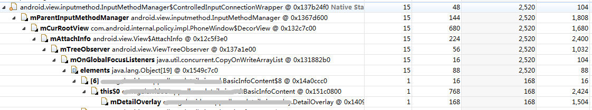

###  由ViewTreeObserver引起的内存泄漏问题

#### 源码

[android.view.View](https://android.googlesource.com/platform/frameworks/base/+/refs/tags/android-5.0.0_r1/core/java/android/view/View.java)
```java
    /**
     * Returns the ViewTreeObserver for this view's hierarchy. The view tree
     * observer can be used to get notifications when global events, like
     * layout, happen.
     *
     * The returned ViewTreeObserver observer is not guaranteed to remain
     * valid for the lifetime of this View. If the caller of this method keeps
     * a long-lived reference to ViewTreeObserver, it should always check for
     * the return value of {@link ViewTreeObserver#isAlive()}.
     *
     * @return The ViewTreeObserver for this view's hierarchy.
     */
    public ViewTreeObserver getViewTreeObserver() {
        if (mAttachInfo != null) {
            return mAttachInfo.mTreeObserver;
        }
        if (mFloatingTreeObserver == null) {
            mFloatingTreeObserver = new ViewTreeObserver();
        }
        return mFloatingTreeObserver;
    }
```

```java
    /**
     * @param info the {@link android.view.View.AttachInfo} to associated with
     *        this view
     */
    void dispatchAttachedToWindow(AttachInfo info, int visibility) {
        ......
        if (mFloatingTreeObserver != null) {
            info.mTreeObserver.merge(mFloatingTreeObserver);
            mFloatingTreeObserver = null;
        }
        ......
    }
```

[android.view.ViewTreeObserver](https://android.googlesource.com/platform/frameworks/base/+/refs/tags/android-5.0.0_r1/core/java/android/view/ViewTreeObserver.java)
```java
/**
 * A view tree observer is used to register listeners that can be notified of global
 * changes in the view tree. Such global events include, but are not limited to,
 * layout of the whole tree, beginning of the drawing pass, touch mode change....
 *
 * A ViewTreeObserver should never be instantiated by applications as it is provided
 * by the views hierarchy. Refer to {@link android.view.View#getViewTreeObserver()}
 * for more information.
 */
public final class ViewTreeObserver {
    ......
}
```

* 从源码上可以看出，如果View还__未attach__或者View__已经detach__，那么我们通过View.getViewTreeObserver()方法，获取到的是__mFloatingTreeObserver__。

* 这样就会存在一个问题：如果我们在View__已经detach__的状态下，尝试去注销listener，那么，我们注销的只是__mFloatingTreeObserver__中的listener；而__mAttachInfo.mTreeObserver__中的listener并未被注销，酱紫就会出现内存泄漏。


#### 实例

##### 例1



上图是首页内嵌详情页面发现的内存泄漏问题，几乎所有的OnGlobalFocusListener都未被正常注销；

##### 例2

```Java
public static void test(final View view) {
        //register listener
        view.getViewTreeObserver().addOnGlobalLayoutListener(
                new ViewTreeObserver.OnGlobalLayoutListener() {
                    @Override
                    public void onGlobalLayout() {
                        // do something
                        // ...
                        // unregister listener
                        view.getViewTreeObserver()
                                .removeOnGlobalLayoutListener(this);
                    }
        });
    }
```
另外这是最常见的一种使用方式，正常来说这个逻辑是没有问题的；但是偶尔，也有可能会出现__该listener注册了但是未被回调__的情况，也就是注销逻辑并不一定会被执行到，因此而出现内存泄漏。


#### 总结

###### 前置条件 

* 这个问题出现的原因在于__注销时机不正确__，也就是在View已经detach了才去尝试注销listener

###### 分析特征

* 泄漏对象通过ViewTreeObserver而被链接到相关系统类


#### 解决

* 应尽量确保View在detach的时候，注销相应的listener

* 另外对于在listener回调中执行注销的逻辑，也应该注意有可能存在该listener被注册而未被回调的情况

* 基线目前已提供兼容处理类ViewTreeObserverDelegate，代理ViewTreeObserver逻辑：View在attach的时候注册所有的listener，View在detach的时候注销所有的listener


#### 附注

* 无
