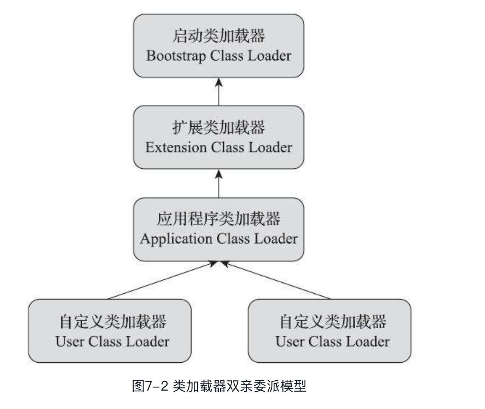

## Android类加载过程浅析

[TOC]


### 一、双亲委托模型



#### 1.1 Java层双亲委托模型


[ClassLoader.java](https://android.googlesource.com/platform/libcore/+/master/ojluni/src/main/java/java/lang/ClassLoader.java)

```java
protected Class<?> loadClass(String name, boolean resolve)
        throws ClassNotFoundException
    {
            // First, check if the class has already been loaded
            Class<?> c = findLoadedClass(name);
            if (c == null) {
                try {
                    if (parent != null) {
                        c = parent.loadClass(name, false);
                    } else {
                        c = findBootstrapClassOrNull(name);
                    }
                } catch (ClassNotFoundException e) {
                    // ClassNotFoundException thrown if class not found
                    // from the non-null parent class loader
                }
                if (c == null) {
                    // If still not found, then invoke findClass in order
                    // to find the class.
                    c = findClass(name);
                }
            }
            return c;
    }
```

- 先查找当前 ClassLoader 是否加载过该 Class，如果已加载过则直接返回该 Class

-  如果当前 ClassLoader 还没加载过该 Class，则**优先委托**给 ParentClassLoader 进行加载

- 如果 ParentClassLoader 加载成功了，则返回该 Class

- 如果 ParentClassLoader 没有找到该 Class，则最后再由当前 ClassLoader 进行加载

- ParentClassLoader 的加载过程也遵循上述逻辑

#### 1.2 Native层双亲委托模型

- [class\_linker](https://android.googlesource.com/platform/art/+/master/runtime/class_linker.cc)

```cpp

bool ClassLinker::FindClassInBaseDexClassLoader(ScopedObjectAccessAlreadyRunnable& soa,
                                                Thread* self,
                                                const char* descriptor,
                                                size_t hash,
                                                Handle<mirror::ClassLoader> class_loader,
                                                /*out*/ ObjPtr<mirror::Class>* result) {
  // Termination case: boot class loader.
  if (IsBootClassLoader(soa, class_loader.Get())) {
    *result = FindClassInBootClassLoaderClassPath(self, descriptor, hash);
    return true;
  }
  
  // >>> 检查是否 PathClassLoader 或 DexClassLoader
  if (IsPathOrDexClassLoader(soa, class_loader) || IsInMemoryDexClassLoader(soa, class_loader)) {
    // >>> 普通的 PathClassLoader 或者 DexClassLoader 加载逻辑：
    // For regular path or dex class loader the search order is:
    //    - parent
    //    - shared libraries
    //    - class loader dex files
    // Handles as RegisterDexFile may allocate dex caches (and cause thread suspension).
    StackHandleScope<1> hs(self);
    Handle<mirror::ClassLoader> h_parent(hs.NewHandle(class_loader->GetParent()));
    
    // >>> 优先委托给 ParentClassLoader 进行加载
    if (!FindClassInBaseDexClassLoader(soa, self, descriptor, hash, h_parent, result)) {
      return false;  // One of the parents is not supported.
    }
    if (*result != nullptr) {
      return true;  // Found the class up the chain.
    }
    
    // >>> 然后再尝试通过 Shared Library ClassLoader 进行加载
    if (!FindClassInSharedLibraries(soa, self, descriptor, hash, class_loader, result)) {
      return false;  // One of the shared library loader is not supported.
    }
    if (*result != nullptr) {
      return true;  // Found the class in a shared library.
    }
    // Search the current class loader classpath.
    
    // >>> 最后再尝试在当前的 ClassLoader 中进行加载
    *result = FindClassInBaseDexClassLoaderClassPath(soa, descriptor, hash, class_loader);
    return !soa.Self()->IsExceptionPending();
  }
  if (IsDelegateLastClassLoader(soa, class_loader)) {
    // >>> DelegateLastClassLoader 加载逻辑：
    // For delegate last, the search order is:
    //    - boot class path
    //    - shared libraries
    //    - class loader dex files
    //    - parent
    
    // >>> 优先在 BootClassLoader 进行加载
    *result = FindClassInBootClassLoaderClassPath(self, descriptor, hash);
    if (*result != nullptr) {
      return true;  // The class is part of the boot class path.
    }
    if (self->IsExceptionPending()) {
      // Pending exception means there was an error other than ClassNotFound that must be returned
      // to the caller.
      return false;
    }
    
    // >>> 然后再尝试在 Shared Library ClassLoader 进行加载
    if (!FindClassInSharedLibraries(soa, self, descriptor, hash, class_loader, result)) {
      return false;  // One of the shared library loader is not supported.
    }
    if (*result != nullptr) {
      return true;  // Found the class in a shared library.
    }
    
    // >>> 接着再尝试在当前的 ClassLoader 中进行加载
    *result = FindClassInBaseDexClassLoaderClassPath(soa, descriptor, hash, class_loader);
    if (*result != nullptr) {
      return true;  // Found the class in the current class loader
    }
    if (self->IsExceptionPending()) {
      // Pending exception means there was an error other than ClassNotFound that must be returned
      // to the caller.
      return false;
    }
    
    // >>> 最后再尝试在 ParentClassLoader 中进行加载
    // Handles as RegisterDexFile may allocate dex caches (and cause thread suspension).
    StackHandleScope<1> hs(self);
    Handle<mirror::ClassLoader> h_parent(hs.NewHandle(class_loader->GetParent()));
    return FindClassInBaseDexClassLoader(soa, self, descriptor, hash, h_parent, result);
  }
  
  // Unsupported class loader.
  *result = nullptr;
  return false;
}
```

- Native 层的双亲委托模型逻辑上与Java层基本是一致的，只不过 Native 层的双亲委托模型只针对 PathClassLoader 和系统的 DexClassLoader 类生效。任何应用拓展的 PathClassLoader 或 DexClassLoader 都不会生效

- Native 层的双亲委托模型主要是为了解决类加载过程中频繁的在 Java 层和 Native 层之间进行调用的性能问题

- 为什么只针对 PathClassLoader 和系统的 DexClassLoader 类生效呢，主要是因为应用拓展的 ClassLoader 有可能存在一些自定义的加载逻辑，没办法做到 Java 层和 Native 层逻辑保持一致。

- 注意这里的 **FindClassInBaseDexClassLoader** 并不是字面上的意思，类似于 ClassLoader 的 findClass 方法：事实上，该方法执行的是类加载过程而不是查找过程

```cpp
bool ClassLinker::FindClassInBaseDexClassLoaderClassPath(
    ScopedObjectAccessAlreadyRunnable& soa,
    const char* descriptor,
    size_t hash,
    Handle<mirror::ClassLoader> class_loader,
    /*out*/ ObjPtr<mirror::Class>* result) {
    
  // >>> 遍历 DexFileList，查找  ClassDef
  const DexFile* dex_file = nullptr;
  const dex::ClassDef* class_def = nullptr;
  ObjPtr<mirror::Class> ret;
  auto find_class_def = [&](const DexFile* cp_dex_file) REQUIRES_SHARED(Locks::mutator_lock_) {
    const dex::ClassDef* cp_class_def = OatDexFile::FindClassDef(*cp_dex_file, descriptor, hash);
    if (cp_class_def != nullptr) {
      dex_file = cp_dex_file;
      class_def = cp_class_def;
      return false;  // Found a class definition, stop visit.
    }
    return true;  // Continue with the next DexFile.
  };
  VisitClassLoaderDexFiles(soa, class_loader, find_class_def);
  
  // >>> 尝试加载该类（如果已加载，则返回已加载的类，不会重复加载）
  if (class_def != nullptr) {
    *result = DefineClass(soa.Self(), descriptor, hash, class_loader, *dex_file, *class_def);
   }
  // A BaseDexClassLoader is always a known lookup.
  return true;
}
```


### 二、Class加载过程

#### 2.1 解释执行

- [AndroidART解释执行过程源码浅析](./AndroidART解释执行过程源码浅析.md)

- [class\_linker-inl.h](https://android.googlesource.com/platform/art/+/master/runtime/class_linker-inl.h)

- [entrypoint\_utils-inl.h](https://android.googlesource.com/platform/art/+/refs/heads/pie-r2-release/runtime/entrypoints/entrypoint_utils-inl.h)

- [class\_linker.cc](https://android.googlesource.com/platform/art/+/master/runtime/class_linker.cc)


#### 2.2 编译执行

- [AndroidART编译执行过程源码浅析](./AndroidART编译执行过程源码浅析.md)

- [class\_linker.cc](https://android.googlesource.com/platform/art/+/master/runtime/class_linker.cc)


#### 2.3 FindClass

- [class\_linker.cc](https://android.googlesource.com/platform/art/+/master/runtime/class_linker.cc)

```cpp
ObjPtr<mirror::Class> ClassLinker::FindClass(Thread* self,
                                             const char* descriptor,
                                             Handle<mirror::ClassLoader> class_loader) {
  ......
  // >>> 判断是否基础类型
  if (descriptor[1] == '\0') {
    // only the descriptors of primitive types should be 1 character long, also avoid class lookup
    // for primitive classes that aren't backed by dex files.
    return FindPrimitiveClass(descriptor[0]);
  }
  
  // >>> 首先查找是否已经加载过该 Class
  const size_t hash = ComputeModifiedUtf8Hash(descriptor);
  // Find the class in the loaded classes table.
  ObjPtr<mirror::Class> klass = LookupClass(self, descriptor, hash, class_loader.Get());
  if (klass != nullptr) {
    // >>> 多线程加载的场景下，需等待 Class 初始化完成
    return EnsureResolved(self, descriptor, klass);
  }
  
  // >>> Class 未加载且 class_loader 为空, 表示需要加载 BootClassLoader 的类，这里快速处理一下
  // Class is not yet loaded.
  if (descriptor[0] != '[' && class_loader == nullptr) {
    // Non-array class and the boot class loader, search the boot class path.
    ClassPathEntry pair = FindInClassPath(descriptor, hash, boot_class_path_);
    if (pair.second != nullptr) {
      return DefineClass(self,
                         descriptor,
                         hash,
                         ScopedNullHandle<mirror::ClassLoader>(),
                         *pair.first,
                         *pair.second);
    } else {
      .....
      return nullptr;
    }
  }
  
  ObjPtr<mirror::Class> result_ptr;
  bool descriptor_equals;
  if (descriptor[0] == '[') {
    // >>> 加载数组类
    result_ptr = CreateArrayClass(self, descriptor, hash, class_loader);
    DCHECK_EQ(result_ptr == nullptr, self->IsExceptionPending());
    DCHECK(result_ptr == nullptr || result_ptr->DescriptorEquals(descriptor));
    descriptor_equals = true;
  } else {
    // >>> 加载普通类
    ScopedObjectAccessUnchecked soa(self);
    // >>> 快速通道：使用 Native 实现的双亲委托模型加载
    bool known_hierarchy =
        FindClassInBaseDexClassLoader(soa, self, descriptor, hash, class_loader, &result_ptr);
    if (result_ptr != nullptr) {
      ......
      descriptor_equals = true;
    } else if (!self->IsExceptionPending()) {
      ......
      std::string class_name_string(descriptor + 1, descriptor_length - 2);
      std::replace(class_name_string.begin(), class_name_string.end(), '/', '.');
      if (known_hierarchy &&
          fast_class_not_found_exceptions_ &&
          !Runtime::Current()->IsJavaDebuggable()) {
        // >>> 抛出 ClassNotFoundException
        self->ThrowNewExceptionF("Ljava/lang/ClassNotFoundException;",
                                 "%s",
                                 class_name_string.c_str());
      } else {
        // >>> 最后通过调用 ClassLoader.loadClass() 进行加载
        // >>> 如果是自定义的 ClassLoader，就是在这里开始执行自定义的类加载逻辑的 
        ScopedLocalRef<jobject> class_loader_object(
            soa.Env(), soa.AddLocalReference<jobject>(class_loader.Get()));
        ScopedLocalRef<jobject> result(soa.Env(), nullptr);
        {
          ......    
          result.reset(soa.Env()->CallObjectMethod(class_loader_object.get(),
                                                   WellKnownClasses::java_lang_ClassLoader_loadClass,
                                                   class_name_object.get()));
        }
        ......
        result_ptr = soa.Decode<mirror::Class>(result.get());
        // Check the name of the returned class.
        descriptor_equals = (result_ptr != nullptr) && result_ptr->DescriptorEquals(descriptor);
      }
    } else {
      DCHECK(!MatchesDexFileCaughtExceptions(self->GetException(), this));
    }
  }
  
  if (self->IsExceptionPending()) {
    // >>> 如果出现异常了，则再次尝试查找是否有其他线程成功加载了该 Class
    // If the ClassLoader threw or array class allocation failed, pass that exception up.
    // However, to comply with the RI behavior, first check if another thread succeeded.
    result_ptr = LookupClass(self, descriptor, hash, class_loader.Get());
    if (result_ptr != nullptr && !result_ptr->IsErroneous()) {
      self->ClearException();
      return EnsureResolved(self, descriptor, result_ptr);
    }
    return nullptr;
  }
  
  // >>> 尝试将该 Class 缓存到 ClassTable 中
  // Try to insert the class to the class table, checking for mismatch.
  ObjPtr<mirror::Class> old;
  {
    WriterMutexLock mu(self, *Locks::classlinker_classes_lock_);
    ClassTable* const class_table = InsertClassTableForClassLoader(class_loader.Get());
    old = class_table->Lookup(descriptor, hash);
    if (old == nullptr) {
      old = result_ptr;  // For the comparison below, after releasing the lock.
      if (descriptor_equals) {
        class_table->InsertWithHash(result_ptr, hash);
        WriteBarrier::ForEveryFieldWrite(class_loader.Get());
      }  // else throw below, after releasing the lock.
    }
  }
  
  // >>> 首次加载该 Class，需要确保该 Class 初始化完成
  if (UNLIKELY(old != result_ptr)) {
    ......
    return EnsureResolved(self, descriptor, old);
  }
  
  ......
  // Success.
  return result_ptr;
}
```


#### 2.4 CreateArrayClass

```cpp
ObjPtr<mirror::Class> ClassLinker::CreateArrayClass(Thread* self,
                                                    const char* descriptor,
                                                    size_t hash,
                                                    Handle<mirror::ClassLoader> class_loader) {
  ......
  // >>> 调用 FindClass 方法加载数组元素 Class
  MutableHandle<mirror::Class> component_type(hs.NewHandle(FindClass(self, descriptor + 1,
                                                                     class_loader)));
  if (component_type == nullptr) {
    DCHECK(self->IsExceptionPending());
    // We need to accept erroneous classes as component types.
    const size_t component_hash = ComputeModifiedUtf8Hash(descriptor + 1);
    component_type.Assign(LookupClass(self, descriptor + 1, component_hash, class_loader.Get()));
    if (component_type == nullptr) {
      DCHECK(self->IsExceptionPending());
      return nullptr;
    } else {
      self->ClearException();
    }
  }
  
  // >>> 如果当前 class_loader 不等于数组元素 Class 的 ClassLoader，则尝试查找数据元素 Class 对应的 ClassLoader 是否加载过该数组类
    ......
  if (class_loader.Get() != component_type->GetClassLoader()) {
    ObjPtr<mirror::Class> new_class =
        LookupClass(self, descriptor, hash, component_type->GetClassLoader());
    if (new_class != nullptr) {
      return new_class;
    }
  }
  
  ......
  // >>> 初始化数组类
  size_t array_class_size = mirror::Array::ClassSize(image_pointer_size_);
  auto visitor = [this, array_class_size, component_type](ObjPtr<mirror::Object> obj,
                                                          size_t usable_size)
      REQUIRES_SHARED(Locks::mutator_lock_) {
    ScopedAssertNoNewTransactionRecords sanntr("CreateArrayClass");
    mirror::Class::InitializeClassVisitor init_class(array_class_size);
    init_class(obj, usable_size);
    ObjPtr<mirror::Class> klass = ObjPtr<mirror::Class>::DownCast(obj);
    klass->SetComponentType(component_type.Get());
    // Do not hold lock for initialization, the fence issued after the visitor
    // returns ensures memory visibility together with the implicit consume
    // semantics (for all supported architectures) for any thread that loads
    // the array class reference from any memory locations afterwards.
    FinishArrayClassSetup(klass);
  };
  auto new_class = hs.NewHandle<mirror::Class>(
      AllocClass(self, GetClassRoot<mirror::Class>(this), array_class_size, visitor));
  if (new_class == nullptr) {
    self->AssertPendingOOMException();
    return nullptr;
  }
  
  // >>> 尝试将新创建的数组类保存到 ClassTable 中
  ObjPtr<mirror::Class> existing = InsertClass(descriptor, new_class.Get(), hash);
  if (existing == nullptr) {
    // We postpone ClassLoad and ClassPrepare events to this point in time to avoid
    // duplicate events in case of races. Array classes don't really follow dedicated
    // load and prepare, anyways.
    Runtime::Current()->GetRuntimeCallbacks()->ClassLoad(new_class);
    Runtime::Current()->GetRuntimeCallbacks()->ClassPrepare(new_class, new_class);
    jit::Jit::NewTypeLoadedIfUsingJit(new_class.Get());
    return new_class.Get();
  }
  
  // >>> 其他线程已经创建了数组类并保存到 ClassTable 中，则使用该类
  // Another thread must have loaded the class after we
  // started but before we finished.  Abandon what we've
  // done.
  //
  // (Yes, this happens.)
  return existing;
}
```


#### 2.5 LookupClass

```cpp
ObjPtr<mirror::Class> ClassLinker::LookupClass(Thread* self,
                                               const char* descriptor,
                                               size_t hash,
                                               ObjPtr<mirror::ClassLoader> class_loader) {
  ReaderMutexLock mu(self, *Locks::classlinker_classes_lock_);
  ClassTable* const class_table = ClassTableForClassLoader(class_loader);
  if (class_table != nullptr) {
    // >>> 查找 ClassLoader 对应的 ClassTable 是否加载过该 Class
    ObjPtr<mirror::Class> result = class_table->Lookup(descriptor, hash);
    if (result != nullptr) {
      return result;
    }
  }
  return nullptr;
}
```


#### 2.6 DefineClass

```cpp
ObjPtr<mirror::Class> ClassLinker::DefineClass(Thread* self,
                                               const char* descriptor,
                                               size_t hash,
                                               Handle<mirror::ClassLoader> class_loader,
                                               const DexFile& dex_file,
                                               const dex::ClassDef& dex_class_def) {
  ScopedDefiningClass sdc(self);
  StackHandleScope<3> hs(self);
  metrics::AutoTimer timer{GetMetrics()->ClassLoadingTotalTime()};
  auto klass = hs.NewHandle<mirror::Class>(nullptr);
  
  // >>> 特殊类特殊处理
  // Load the class from the dex file.
  if (UNLIKELY(!init_done_)) {
    // finish up init of hand crafted class_roots_
    if (strcmp(descriptor, "Ljava/lang/Object;") == 0) {
      klass.Assign(GetClassRoot<mirror::Object>(this));
    } else if (strcmp(descriptor, "Ljava/lang/Class;") == 0) {
      klass.Assign(GetClassRoot<mirror::Class>(this));
    } else if (strcmp(descriptor, "Ljava/lang/String;") == 0) {
      klass.Assign(GetClassRoot<mirror::String>(this));
    } else if (strcmp(descriptor, "Ljava/lang/ref/Reference;") == 0) {
      klass.Assign(GetClassRoot<mirror::Reference>(this));
    } else if (strcmp(descriptor, "Ljava/lang/DexCache;") == 0) {
      klass.Assign(GetClassRoot<mirror::DexCache>(this));
    } else if (strcmp(descriptor, "Ldalvik/system/ClassExt;") == 0) {
      klass.Assign(GetClassRoot<mirror::ClassExt>(this));
    }
  }
  ......
  // Get the real dex file. This will return the input if there aren't any callbacks or they do
  // nothing.
  DexFile const* new_dex_file = nullptr;
  dex::ClassDef const* new_class_def = nullptr;
  
  // >>> 发布 ClassPreDefine 事件回调
  // TODO We should ideally figure out some way to move this after we get a lock on the klass so it
  // will only be called once.
  Runtime::Current()->GetRuntimeCallbacks()->ClassPreDefine(descriptor,
                                                            klass,
                                                            class_loader,
                                                            dex_file,
                                                            dex_class_def,
                                                            &new_dex_file,
                                                            &new_class_def);
  ......
  
  // >>> 初始化 DexCache
  ObjPtr<mirror::DexCache> dex_cache = RegisterDexFile(*new_dex_file, class_loader.Get());
  if (dex_cache == nullptr) {
    self->AssertPendingException();
    return sdc.Finish(nullptr);
  }
  klass->SetDexCache(dex_cache);
  
  // >>> 填充基础数据
  SetupClass(*new_dex_file, *new_class_def, klass, class_loader.Get());
  // Mark the string class by setting its access flag.
  if (UNLIKELY(!init_done_)) {
    if (strcmp(descriptor, "Ljava/lang/String;") == 0) {
      klass->SetStringClass();
    }
  }
  
  ObjectLock<mirror::Class> lock(self, klass);
  klass->SetClinitThreadId(self->GetTid());
  // Make sure we have a valid empty iftable even if there are errors.
  klass->SetIfTable(GetClassRoot<mirror::Object>(this)->GetIfTable());
  
  // >>> 尝试将该 Class 保存到 ClassTable 中
  // Add the newly loaded class to the loaded classes table.
  ObjPtr<mirror::Class> existing = InsertClass(descriptor, klass.Get(), hash);
  if (existing != nullptr) {
    // We failed to insert because we raced with another thread. Calling EnsureResolved may cause
    // this thread to block.
    return sdc.Finish(EnsureResolved(self, descriptor, existing));
  }
  
  // >>> 加载类变量和类方法
  // Load the fields and other things after we are inserted in the table. This is so that we don't
  // end up allocating unfree-able linear alloc resources and then lose the race condition. The
  // other reason is that the field roots are only visited from the class table. So we need to be
  // inserted before we allocate / fill in these fields.
  LoadClass(self, *new_dex_file, *new_class_def, klass);
  ......
  
  // >>> 加载父类和接口类
  // Finish loading (if necessary) by finding parents
  CHECK(!klass->IsLoaded());
  if (!LoadSuperAndInterfaces(klass, *new_dex_file)) {
    // Loading failed.
    if (!klass->IsErroneous()) {
      mirror::Class::SetStatus(klass, ClassStatus::kErrorUnresolved, self);
    }
    return sdc.Finish(nullptr);
  }
  
  // >>> 发布 ClassLoad 事件回调
  // At this point the class is loaded. Publish a ClassLoad event.
  // Note: this may be a temporary class. It is a listener's responsibility to handle this.
  Runtime::Current()->GetRuntimeCallbacks()->ClassLoad(klass);
  
  // >>> 解析填充 Class 数据（如 IfTable, ImTable 等）
  // Link the class (if necessary)
  CHECK(!klass->IsResolved());
  // TODO: Use fast jobjects?
  auto interfaces = hs.NewHandle<mirror::ObjectArray<mirror::Class>>(nullptr);
  MutableHandle<mirror::Class> h_new_class = hs.NewHandle<mirror::Class>(nullptr);
  if (!LinkClass(self, descriptor, klass, interfaces, &h_new_class)) {
    // Linking failed.
    if (!klass->IsErroneous()) {
      mirror::Class::SetStatus(klass, ClassStatus::kErrorUnresolved, self);
    }
    return sdc.Finish(nullptr);
  }
  ......

  // >>> 更新方法的入口函数
  // Instrumentation may have updated entrypoints for all methods of all
  // classes. However it could not update methods of this class while we
  // were loading it. Now the class is resolved, we can update entrypoints
  // as required by instrumentation.
  if (Runtime::Current()->GetInstrumentation()->AreExitStubsInstalled()) {
    // We must be in the kRunnable state to prevent instrumentation from
    // suspending all threads to update entrypoints while we are doing it
    // for this class.
    DCHECK_EQ(self->GetState(), ThreadState::kRunnable);
    Runtime::Current()->GetInstrumentation()->InstallStubsForClass(h_new_class.Get());
  }
  
  // >>> 发布 ClassPrepare 事件回调
  /*
   * We send CLASS_PREPARE events to the debugger from here.  The
   * definition of "preparation" is creating the static fields for a
   * class and initializing them to the standard default values, but not
   * executing any code (that comes later, during "initialization").
   *
   * We did the static preparation in LinkClass.
   *
   * The class has been prepared and resolved but possibly not yet verified
   * at this point.
   */
  Runtime::Current()->GetRuntimeCallbacks()->ClassPrepare(klass, h_new_class);
  // Notify native debugger of the new class and its layout.
  jit::Jit::NewTypeLoadedIfUsingJit(h_new_class.Get());
  return sdc.Finish(h_new_class);
}

```

- [instrumentation.cc](https://android.googlesource.com/platform/art/+/master/runtime/instrumentation.cc)


#### 2.7 SetupClass

```cpp
void ClassLinker::SetupClass(const DexFile& dex_file,
                             const dex::ClassDef& dex_class_def,
                             Handle<mirror::Class> klass,
                             ObjPtr<mirror::ClassLoader> class_loader) {
  // >>> 填充基础数据
  CHECK(klass != nullptr);
  CHECK(klass->GetDexCache() != nullptr);
  CHECK_EQ(ClassStatus::kNotReady, klass->GetStatus());
  const char* descriptor = dex_file.GetClassDescriptor(dex_class_def);
  CHECK(descriptor != nullptr);
  klass->SetClass(GetClassRoot<mirror::Class>(this));
  uint32_t access_flags = dex_class_def.GetJavaAccessFlags();
  CHECK_EQ(access_flags & ~kAccJavaFlagsMask, 0U);
  klass->SetAccessFlagsDuringLinking(access_flags);
  klass->SetClassLoader(class_loader);
  DCHECK_EQ(klass->GetPrimitiveType(), Primitive::kPrimNot);
  mirror::Class::SetStatus(klass, ClassStatus::kIdx, nullptr);
  klass->SetDexClassDefIndex(dex_file.GetIndexForClassDef(dex_class_def));
  klass->SetDexTypeIndex(dex_class_def.class_idx_);
}
```


#### 2.8 LoadClass

```cpp
void ClassLinker::LoadClass(Thread* self,
                            const DexFile& dex_file,
                            const dex::ClassDef& dex_class_def,
                            Handle<mirror::Class> klass) {
  ......
  Runtime* const runtime = Runtime::Current();
  {
    ......
    // >>> 为静态变量和实例变量分配内存
    LinearAlloc* const allocator = GetAllocatorForClassLoader(klass->GetClassLoader());
    LengthPrefixedArray<ArtField>* sfields = AllocArtFieldArray(self,
                                                                allocator,
                                                                accessor.NumStaticFields());
    LengthPrefixedArray<ArtField>* ifields = AllocArtFieldArray(self,
                                                                allocator,
                                                                accessor.NumInstanceFields());
                                                                
    size_t num_sfields = 0u;
    size_t num_ifields = 0u;
    uint32_t last_static_field_idx = 0u;
    uint32_t last_instance_field_idx = 0u;
    
    // >>> 加载 OatClass
    // Methods
    bool has_oat_class = false;
    const OatFile::OatClass oat_class = (runtime->IsStarted() && !runtime->IsAotCompiler())
        ? OatFile::FindOatClass(dex_file, klass->GetDexClassDefIndex(), &has_oat_class)
        : OatFile::OatClass::Invalid();
    const OatFile::OatClass* oat_class_ptr = has_oat_class ? &oat_class : nullptr;
    klass->SetMethodsPtr(
        AllocArtMethodArray(self, allocator, accessor.NumMethods()),
        accessor.NumDirectMethods(),
        accessor.NumVirtualMethods());
    size_t class_def_method_index = 0;
    uint32_t last_dex_method_index = dex::kDexNoIndex;
    size_t last_class_def_method_index = 0;
    uint16_t hotness_threshold = runtime->GetJITOptions()->GetWarmupThreshold();
    
    // >>> 加载变量和方法
    // Use the visitor since the ranged based loops are bit slower from seeking. Seeking to the
    // methods needs to decode all of the fields.
    accessor.VisitFieldsAndMethods([&](
        const ClassAccessor::Field& field) REQUIRES_SHARED(Locks::mutator_lock_) {
          uint32_t field_idx = field.GetIndex();
          DCHECK_GE(field_idx, last_static_field_idx);  // Ordering enforced by DexFileVerifier.
          if (num_sfields == 0 || LIKELY(field_idx > last_static_field_idx)) {
            // >>> 加载静态变量
            LoadField(field, klass, &sfields->At(num_sfields));
            ++num_sfields;
            last_static_field_idx = field_idx;
          }
        }, [&](const ClassAccessor::Field& field) REQUIRES_SHARED(Locks::mutator_lock_) {
          uint32_t field_idx = field.GetIndex();
          DCHECK_GE(field_idx, last_instance_field_idx);  // Ordering enforced by DexFileVerifier.
          if (num_ifields == 0 || LIKELY(field_idx > last_instance_field_idx)) {
            // 加载实例变量
            LoadField(field, klass, &ifields->At(num_ifields));
            ++num_ifields;
            last_instance_field_idx = field_idx;
          }
        }, [&](const ClassAccessor::Method& method) REQUIRES_SHARED(Locks::mutator_lock_) {
          ArtMethod* art_method = klass->GetDirectMethodUnchecked(class_def_method_index,
              image_pointer_size_);
          // >>> 加载非虚方法(包括静态方法)    
          LoadMethod(dex_file, method, klass.Get(), art_method);
          // >>> 设置跳转函数
          LinkCode(this, art_method, oat_class_ptr, class_def_method_index);
          uint32_t it_method_index = method.GetIndex();
          if (last_dex_method_index == it_method_index) {
            // duplicate case
            art_method->SetMethodIndex(last_class_def_method_index);
          } else {
            art_method->SetMethodIndex(class_def_method_index);
            last_dex_method_index = it_method_index;
            last_class_def_method_index = class_def_method_index;
          }
          art_method->ResetCounter(hotness_threshold);
          ++class_def_method_index;
        }, [&](const ClassAccessor::Method& method) REQUIRES_SHARED(Locks::mutator_lock_) {
          ArtMethod* art_method = klass->GetVirtualMethodUnchecked(
              class_def_method_index - accessor.NumDirectMethods(),
              image_pointer_size_);
          art_method->ResetCounter(hotness_threshold);
          // >>> 加载虚方法
          LoadMethod(dex_file, method, klass.Get(), art_method);
          // >>> 设置跳转函数
          LinkCode(this, art_method, oat_class_ptr, class_def_method_index);
          ++class_def_method_index;
        });
        
    ......
    // Set the field arrays.
    klass->SetSFieldsPtr(sfields);
    DCHECK_EQ(klass->NumStaticFields(), num_sfields);
    klass->SetIFieldsPtr(ifields);
    DCHECK_EQ(klass->NumInstanceFields(), num_ifields);
  }
  // Ensure that the card is marked so that remembered sets pick up native roots.
  WriteBarrier::ForEveryFieldWrite(klass.Get());
  self->AllowThreadSuspension();
}
```


#### 2.9 LoadField

```cpp
void ClassLinker::LoadField(const ClassAccessor::Field& field,
                            Handle<mirror::Class> klass,
                            ArtField* dst) {
  // >>> 加载 Field                          
  const uint32_t field_idx = field.GetIndex();
  dst->SetDexFieldIndex(field_idx);
  dst->SetDeclaringClass(klass.Get());
  // Get access flags from the DexFile and set hiddenapi runtime access flags.
  dst->SetAccessFlags(field.GetAccessFlags() | hiddenapi::CreateRuntimeFlags(field));
}
```


#### 2.10 LoadMethod

```cpp
void ClassLinker::LoadMethod(const DexFile& dex_file,
                             const ClassAccessor::Method& method,
                             ObjPtr<mirror::Class> klass,
                             ArtMethod* dst) {
  ScopedAssertNoThreadSuspension sants(__FUNCTION__);
  const uint32_t dex_method_idx = method.GetIndex();
  const dex::MethodId& method_id = dex_file.GetMethodId(dex_method_idx);
  uint32_t name_utf16_length;
  const char* method_name = dex_file.StringDataAndUtf16LengthByIdx(method_id.name_idx_,
                                                                   &name_utf16_length);
  std::string_view shorty = dex_file.GetShortyView(dex_file.GetProtoId(method_id.proto_idx_));
  dst->SetDexMethodIndex(dex_method_idx);
  dst->SetDeclaringClass(klass);
  // Get access flags from the DexFile and set hiddenapi runtime access flags.
  uint32_t access_flags = method.GetAccessFlags() | hiddenapi::CreateRuntimeFlags(method);
  auto has_ascii_name = [method_name, name_utf16_length](const char* ascii_name,
                                                         size_t length) ALWAYS_INLINE {
    DCHECK_EQ(strlen(ascii_name), length);
    return length == name_utf16_length &&
           method_name[length] == 0 &&  // Is `method_name` an ASCII string?
           memcmp(ascii_name, method_name, length) == 0;
  };
  if (UNLIKELY(has_ascii_name("finalize", sizeof("finalize") - 1u))) {
    // >>> 处理 finalize 方法
    // Set finalizable flag on declaring class.
    if (shorty == "V") {
      // Void return type.
      if (klass->GetClassLoader() != nullptr) {  // All non-boot finalizer methods are flagged.
        klass->SetFinalizable();
      } else {
        std::string_view klass_descriptor =
            dex_file.GetTypeDescriptorView(dex_file.GetTypeId(klass->GetDexTypeIndex()));
        // The Enum class declares a "final" finalize() method to prevent subclasses from
        // introducing a finalizer. We don't want to set the finalizable flag for Enum or its
        // subclasses, so we exclude it here.
        // We also want to avoid setting the flag on Object, where we know that finalize() is
        // empty.
        if (klass_descriptor != "Ljava/lang/Object;" &&
            klass_descriptor != "Ljava/lang/Enum;") {
          klass->SetFinalizable();
        }
      }
    }
  } else if (method_name[0] == '<') {
    // >>> 处理类初始化(<clinit>)和实例构造方法(<init>)
    // Fix broken access flags for initializers. Bug 11157540.
    bool is_init = has_ascii_name("<init>", sizeof("<init>") - 1u);
    bool is_clinit = has_ascii_name("<clinit>", sizeof("<clinit>") - 1u);
    if (UNLIKELY(!is_init && !is_clinit)) {
      LOG(WARNING) << "Unexpected '<' at start of method name " << method_name;
    } else {
      if (UNLIKELY((access_flags & kAccConstructor) == 0)) {
        LOG(WARNING) << method_name << " didn't have expected constructor access flag in class "
            << klass->PrettyDescriptor() << " in dex file " << dex_file.GetLocation();
        access_flags |= kAccConstructor;
      }
    }
  }
  
  .....
  if (UNLIKELY((access_flags & kAccNative) != 0u)) {
    // >>> 处理 JNI 方法
    // Check if the native method is annotated with @FastNative or @CriticalNative.
    const dex::ClassDef& class_def = dex_file.GetClassDef(klass->GetDexClassDefIndex());
    access_flags |=
        annotations::GetNativeMethodAnnotationAccessFlags(dex_file, class_def, dex_method_idx);
    dst->SetAccessFlags(access_flags);
    ......
    dst->SetDataPtrSize(nullptr, image_pointer_size_);  // JNI stub/trampoline not linked yet.
  } else if ((access_flags & kAccAbstract) != 0u) {
    // >>> 处理抽象(Abstract)方法
    dst->SetAccessFlags(access_flags);
    // Must be done after SetAccessFlags since IsAbstract depends on it.
    if (klass->IsInterface()) {
      dst->CalculateAndSetImtIndex();
    }
    ......
    dst->SetDataPtrSize(nullptr, image_pointer_size_);  // Single implementation not set yet.
  } else {
    // >>> 处理普通方法
    // Check for nterp entry fast-path based on shorty.
    if (all_parameters_are_reference) {
      access_flags |= kAccNterpEntryPointFastPathFlag;
    }
    const dex::ClassDef& class_def = dex_file.GetClassDef(klass->GetDexClassDefIndex());
    if (annotations::MethodIsNeverCompile(dex_file, class_def, dex_method_idx)) {
      access_flags |= kAccCompileDontBother;
    }
    ......
    dst->SetAccessFlags(access_flags);
    uint32_t code_item_offset = method.GetCodeItemOffset();
    // >>> 设置 CodeItem
    if (Runtime::Current()->IsAotCompiler()) {
      dst->SetDataPtrSize(reinterpret_cast32<void*>(code_item_offset), image_pointer_size_);
    } else {
      dst->SetCodeItem(dex_file.GetCodeItem(code_item_offset), dex_file.IsCompactDexFile());
    }
  }
  ......
}
```


#### 2.11 LinkCode

```cpp
static void LinkCode(ClassLinker* class_linker,
                     ArtMethod* method,
                     const OatFile::OatClass* oat_class,
                     uint32_t class_def_method_index) REQUIRES_SHARED(Locks::mutator_lock_) {
  ScopedAssertNoThreadSuspension sants(__FUNCTION__);
  Runtime* const runtime = Runtime::Current();
  if (runtime->IsAotCompiler()) {
    // >>> AOT 不需要链接
    // The following code only applies to a non-compiler runtime.
    return;
  }
  
  ......
  const void* quick_code = nullptr;
  if (oat_class != nullptr) {
    // Every kind of method should at least get an invoke stub from the oat_method.
    // non-abstract methods also get their code pointers.
    const OatFile::OatMethod oat_method = oat_class->GetOatMethod(class_def_method_index);
    quick_code = oat_method.GetQuickCode();
  }
  
  // >>> 调用 Instrumentation 设置其跳转函数
  runtime->GetInstrumentation()->InitializeMethodsCode(method, quick_code);
  if (method->IsNative()) {
    // >>> JNI 方法，设置跳转函数
    // Set up the dlsym lookup stub. Do not go through `UnregisterNative()`
    // as the extra processing for @CriticalNative is not needed yet.
    method->SetEntryPointFromJni(
        method->IsCriticalNative() ? GetJniDlsymLookupCriticalStub() : GetJniDlsymLookupStub());
  }
}
```

- [instrumentation.cc](https://android.googlesource.com/platform/art/+/master/runtime/instrumentation.cc)


#### 2.12 LoadSuperAndInterfaces

```cpp
bool ClassLinker::LoadSuperAndInterfaces(Handle<mirror::Class> klass, const DexFile& dex_file) {
  CHECK_EQ(ClassStatus::kIdx, klass->GetStatus());
  const dex::ClassDef& class_def = dex_file.GetClassDef(klass->GetDexClassDefIndex());
  dex::TypeIndex super_class_idx = class_def.superclass_idx_;
  if (super_class_idx.IsValid()) {
    // Check that a class does not inherit from itself directly.
    ......
    
    // >>> 加载 SuperClass
    ObjPtr<mirror::Class> super_class = ResolveType(super_class_idx, klass.Get());
    if (super_class == nullptr) {
      DCHECK(Thread::Current()->IsExceptionPending());
      return false;
    }
    
    // >>> 验证调用权限
    // Verify
    if (!klass->CanAccess(super_class)) {
      ThrowIllegalAccessError(klass.Get(), "Class %s extended by class %s is inaccessible",
                              super_class->PrettyDescriptor().c_str(),
                              klass->PrettyDescriptor().c_str());
      return false;
    }
    CHECK(super_class->IsResolved());
    klass->SetSuperClass(super_class);
  }
  
  const dex::TypeList* interfaces = dex_file.GetInterfacesList(class_def);
  if (interfaces != nullptr) {
    for (size_t i = 0; i < interfaces->Size(); i++) {
      dex::TypeIndex idx = interfaces->GetTypeItem(i).type_idx_;
      // >>> 加载接口类（ Interface ）
      ObjPtr<mirror::Class> interface = ResolveType(idx, klass.Get());
      if (interface == nullptr) {
        DCHECK(Thread::Current()->IsExceptionPending());
        return false;
      }
      
      // >>> 验证调用权限
      // Verify
      if (!klass->CanAccess(interface)) {
        // TODO: the RI seemed to ignore this in my testing.
        ThrowIllegalAccessError(klass.Get(),
                                "Interface %s implemented by class %s is inaccessible",
                                interface->PrettyDescriptor().c_str(),
                                klass->PrettyDescriptor().c_str());
        return false;
      }
    }
  }
  
  // Mark the class as loaded.
  mirror::Class::SetStatus(klass, ClassStatus::kLoaded, nullptr);
  return true;
}
```


#### 2.13 LinkClass

```cpp
bool ClassLinker::LinkClass(Thread* self,
                            const char* descriptor,
                            Handle<mirror::Class> klass,
                            Handle<mirror::ObjectArray<mirror::Class>> interfaces,
                            MutableHandle<mirror::Class>* h_new_class_out) {
  CHECK_EQ(ClassStatus::kLoaded, klass->GetStatus());
  if (!LinkSuperClass(klass)) {
    return false;
  }
  ArtMethod* imt_data[ImTable::kSize];
  // If there are any new conflicts compared to super class.
  bool new_conflict = false;
  std::fill_n(imt_data, arraysize(imt_data), Runtime::Current()->GetImtUnimplementedMethod());
  if (!LinkMethods(self, klass, interfaces, &new_conflict, imt_data)) {
    return false;
  }
  if (!LinkInstanceFields(self, klass)) {
    return false;
  }
  size_t class_size;
  if (!LinkStaticFields(self, klass, &class_size)) {
    return false;
  }
  CreateReferenceInstanceOffsets(klass);
  CHECK_EQ(ClassStatus::kLoaded, klass->GetStatus());
  ImTable* imt = nullptr;
  if (klass->ShouldHaveImt()) {
    // If there are any new conflicts compared to the super class we can not make a copy. There
    // can be cases where both will have a conflict method at the same slot without having the same
    // set of conflicts. In this case, we can not share the IMT since the conflict table slow path
    // will possibly create a table that is incorrect for either of the classes.
    // Same IMT with new_conflict does not happen very often.
    if (!new_conflict) {
      ImTable* super_imt = FindSuperImt(klass.Get(), image_pointer_size_);
      if (super_imt != nullptr) {
        bool imt_equals = true;
        for (size_t i = 0; i < ImTable::kSize && imt_equals; ++i) {
          imt_equals = imt_equals && (super_imt->Get(i, image_pointer_size_) == imt_data[i]);
        }
        if (imt_equals) {
          imt = super_imt;
        }
      }
    }
    if (imt == nullptr) {
      LinearAlloc* allocator = GetAllocatorForClassLoader(klass->GetClassLoader());
      imt = reinterpret_cast<ImTable*>(
          allocator->Alloc(self, ImTable::SizeInBytes(image_pointer_size_)));
      if (imt == nullptr) {
        return false;
      }
      imt->Populate(imt_data, image_pointer_size_);
    }
  }
  if (!klass->IsTemp() || (!init_done_ && klass->GetClassSize() == class_size)) {
    // We don't need to retire this class as it has no embedded tables or it was created the
    // correct size during class linker initialization.
    CHECK_EQ(klass->GetClassSize(), class_size) << klass->PrettyDescriptor();
    if (klass->ShouldHaveEmbeddedVTable()) {
      klass->PopulateEmbeddedVTable(image_pointer_size_);
    }
    if (klass->ShouldHaveImt()) {
      klass->SetImt(imt, image_pointer_size_);
    }
    // Update CHA info based on whether we override methods.
    // Have to do this before setting the class as resolved which allows
    // instantiation of klass.
    if (LIKELY(descriptor != nullptr) && cha_ != nullptr) {
      cha_->UpdateAfterLoadingOf(klass);
    }
    // This will notify waiters on klass that saw the not yet resolved
    // class in the class_table_ during EnsureResolved.
    mirror::Class::SetStatus(klass, ClassStatus::kResolved, self);
    h_new_class_out->Assign(klass.Get());
  } else {
    CHECK(!klass->IsResolved());
    // Retire the temporary class and create the correctly sized resolved class.
    StackHandleScope<1> hs(self);
    Handle<mirror::Class> h_new_class =
        hs.NewHandle(mirror::Class::CopyOf(klass, self, class_size, imt, image_pointer_size_));
    // Set arrays to null since we don't want to have multiple classes with the same ArtField or
    // ArtMethod array pointers. If this occurs, it causes bugs in remembered sets since the GC
    // may not see any references to the target space and clean the card for a class if another
    // class had the same array pointer.
    klass->SetMethodsPtrUnchecked(nullptr, 0, 0);
    klass->SetSFieldsPtrUnchecked(nullptr);
    klass->SetIFieldsPtrUnchecked(nullptr);
    if (UNLIKELY(h_new_class == nullptr)) {
      self->AssertPendingOOMException();
      mirror::Class::SetStatus(klass, ClassStatus::kErrorUnresolved, self);
      return false;
    }
    CHECK_EQ(h_new_class->GetClassSize(), class_size);
    ObjectLock<mirror::Class> lock(self, h_new_class);
    FixupTemporaryDeclaringClass(klass.Get(), h_new_class.Get());
    if (LIKELY(descriptor != nullptr)) {
      WriterMutexLock mu(self, *Locks::classlinker_classes_lock_);
      const ObjPtr<mirror::ClassLoader> class_loader = h_new_class.Get()->GetClassLoader();
      ClassTable* const table = InsertClassTableForClassLoader(class_loader);
      const ObjPtr<mirror::Class> existing =
          table->UpdateClass(descriptor, h_new_class.Get(), ComputeModifiedUtf8Hash(descriptor));
      if (class_loader != nullptr) {
        // We updated the class in the class table, perform the write barrier so that the GC knows
        // about the change.
        WriteBarrier::ForEveryFieldWrite(class_loader);
      }
      CHECK_EQ(existing, klass.Get());
      if (log_new_roots_) {
        new_class_roots_.push_back(GcRoot<mirror::Class>(h_new_class.Get()));
      }
    }
    // Update CHA info based on whether we override methods.
    // Have to do this before setting the class as resolved which allows
    // instantiation of klass.
    if (LIKELY(descriptor != nullptr) && cha_ != nullptr) {
      cha_->UpdateAfterLoadingOf(h_new_class);
    }
    // This will notify waiters on temp class that saw the not yet resolved class in the
    // class_table_ during EnsureResolved.
    mirror::Class::SetStatus(klass, ClassStatus::kRetired, self);
    CHECK_EQ(h_new_class->GetStatus(), ClassStatus::kResolving);
    // This will notify waiters on new_class that saw the not yet resolved
    // class in the class_table_ during EnsureResolved.
    mirror::Class::SetStatus(h_new_class, ClassStatus::kResolved, self);
    // Return the new class.
    h_new_class_out->Assign(h_new_class.Get());
  }
  return true;
}
```


