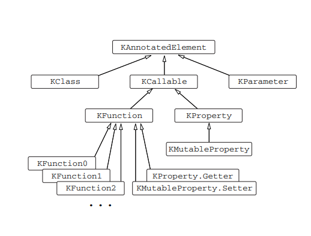

###  Kotlin之Reflection

[reflection.html](https://kotlinlang.org/docs/reference/reflection.html)

[[Kotlin in Action]()]()

#### The Kotlin reflection API: KClass, KCallable, KFunction, and KProperty



##### KClass

```kotlin
interface KClass<T : Any> {
    val simpleName: String?
    val qualifiedName: String?
    val members: Collection<KCallable<*>>
    val constructors: Collection<KFunction<T>>
    val nestedClasses: Collection<KClass<*>>
    ...
}
```

```kotlin
class Person(val name: String, val age: Int)

val kClass = Person::class
val javaClass = Person::class.java

val person = Person("Alice", 29)
val kClass = person.javaClass.kotlin
```

##### KCallable

The list of all members of a class is a collection of KCallable instances. KCallable is a superinterface for functions and properties. It declares the call method, which allows you to call the corresponding function or the getter of the property:

```kotlin
interface KCallable<out R> {
    fun call(vararg args: Any?): R
    ...
}
```

```kotlin
fun foo(x: Int) = println(x)
val kFunction = ::foo
kFunction.call(42)
```

##### KFunction

```kotlin
import kotlin.reflect.KFunction2

fun sum(x: Int, y: Int)=x+y

val kFunction: KFunction2<Int, Int, Int> = ::sum
println(kFunction.invoke(1, 2) + kFunction(3, 4))
```

##### KProperty

Top-level properties are represented by instances ofthe __KProperty0__ interface, which has a no-argument get method:

```kotlin
var counter = 0
val kProperty = ::counter
kProperty.setter.call(21)
println(kProperty.get())
```

A member property is represented by an instance of KProperty1, which has a one-argument get method:

```kotlin
class Person(val name: String, val age: Int)
val person = Person("Alice", 29)
val memberProperty = Person::age
println(memberProperty.get(person))
```

##### callBy

```kotlin
interface KCallable<out R> {
    fun callBy(args: Map<KParameter, Any?>): R
    ...
}
```
The method takes a map of parameters to their corresponding values that will be passed as arguments. If a parameter is missing from the map, its default value will be used if possible. 

One thing you do need to take care of is getting the types right. The type of the value in the args map needs to match the constructor parameter type; 

#### 